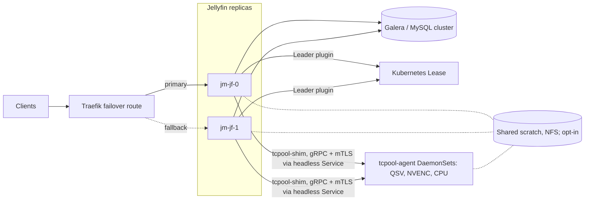

# JellyMesh

Run several Jellyfin 12.1 servers on one shared MySQL/Galera database, with a GPU transcode pool and live Dolby Vision profile 7 -> 8.1 conversion.

[](LICENSE)
[](.github/workflows/transcode.yml)
[](.github/workflows/transcode-images.yml)

**Status:** Implemented, Lab-verified. Dolby Vision 7 -> 8.1 is Production: the maintainer reports it is deployed and plays as Dolby Vision on the maintainer's cluster (2026-09-29). The maintainer runs the whole stack on one home k3s cluster ([docs/operations.md](docs/operations.md)). Label definitions are in [Status and limitations](#status-and-limitations).

**Who this is for and what it needs:**

- You run Jellyfin and want more than one server behind one address, sharing one database.
- The shared database is MySQL 8.4 or Percona XtraDB Cluster; the Leader plugin and the Traefik failover route assume Kubernetes (k3s in the maintainer's setup).
- The transcode pool needs GPU nodes (Intel QSV or NVIDIA NVENC) or CPU workers. The Traefik failover manifests are not in this repository.

## Why

Stock Jellyfin assumes one process over one SQLite file. Running a second server runs into three problems: SQLite allows one writer, some queries perform well only on SQLite, and per-process caches go stale when another server writes.

JellyMesh addresses each of them, so any server can answer any request and the database is the only shared state. Terms such as Galera (synchronous multi-primary MySQL replication), N+1 (one query per row of a first query), and Lease (a Kubernetes object used for leader election) are defined in the [glossary](docs/architecture.md#glossary).

## Where each part lives

| Directory | Contents | Docs |
|---|---|---|
| `galera/` | Galera provider for Jellyfin, `jellyfin-dbmigrate`, lab scripts | [galera/README.md](galera/README.md) |
| `jellyfin-perf/` | Patch series against Jellyfin 12.1, including `JELLYFIN_SHARED_DB=1` | [jellyfin-perf/README.md](jellyfin-perf/README.md) |
| `leader/` | Leader plugin | [leader/README.md](leader/README.md) |
| `transcode/` | Rust GPU pool: `tcpool-shim`, `tcpool-agent`, `tcpool-sync` | [transcode/README.md](transcode/README.md) |
| `image/` | Containerfiles: hotio's Jellyfin 12.1 pinned by digest, plus the patches, provider, and migration tool | [image/README.md](image/README.md) |

## What exists

| Feature | What it does | Status | Docs |
|---|---|---|---|
| Shared database provider | Runs Jellyfin 12.1 on MySQL 8.4 or Percona XtraDB Cluster | Implemented | [galera/README.md](galera/README.md) |
| `jellyfin-dbmigrate` | Lossless SQLite <-> MySQL migration in either direction, with a row-by-row verifier | Implemented | [galera/README.md](galera/README.md) |
| Query patches | Fix N+1 query shapes in people, lyrics, and dedupe, and add a Resume sort key MySQL can plan | Implemented | [jellyfin-perf/README.md](jellyfin-perf/README.md) |
| `JELLYFIN_SHARED_DB=1` | Retries user-data writes and reads user data and login sessions from the database | Implemented | [jellyfin-perf/README.md](jellyfin-perf/README.md) |
| Leader plugin | Runs scheduled tasks once, cluster-wide, using a Kubernetes Lease; outside Kubernetes the node is the leader | Implemented | [docs/operations.md](docs/operations.md) |
| Traefik active/passive failover | Lab route: primary `jm-jf-0`, fallback `jm-jf-1` (n=1 drill) | Lab-verified | [docs/architecture.md](docs/architecture.md#failover-behavior) |
| GPU transcode pool | `tcpool-shim` replaces ffmpeg; one agent per GPU (Intel QSV, NVIDIA NVENC) plus CPU spill; gRPC with mTLS; command allowlist | Implemented | [transcode/README.md](transcode/README.md) |
| Shared transcode directory | Replicas and agents share one scratch directory so a transcode survives replica loss (3-session lab proof, plaintext gRPC, one NVENC agent) | Implemented, opt-in, off by default | [docs/operations.md](docs/operations.md) |
| Dolby Vision 7 -> 8.1 | Converts dual-layer profile 7 sources to profile 8.1 during HLS playback; enable with `JELLYMESH_DOVI_P7_TO_81=1` | Production (2026-09-29), opt-in | [docs/dolby-vision.md](docs/dolby-vision.md) |
| TrueHD to EAC3 5.1 | Makes audio playable in the Android TV app on the Dolby Vision path | Implemented | [docs/dolby-vision.md](docs/dolby-vision.md) |
| Published image | `ghcr.io/saabstory404/jellymesh-jellyfin`, built manually with podman | Implemented | [docs/operations.md](docs/operations.md) |

## Dolby Vision profile 7 -> 8.1, live

JellyMesh converts dual-layer Dolby Vision profile 7 sources to single-layer profile 8.1 during HLS playback, for clients that decode single-layer Dolby Vision. The maintainer reports it is deployed and plays as Dolby Vision on the SHIELD Android TV app, tested repeatedly (Production, 2026-09-29).

The Jellyfin patches decide when to convert. The transcode agent rewrites the in-band RPU (per-frame Dolby Vision metadata) to profile 8.1 and drops the enhancement layer. The HLS job uses fMP4 segments, so the init segment carries a `dvvC` box, which is the signal the app uses to show Dolby Vision.

TrueHD or MLP audio with 6 or more channels is encoded to EAC3 5.1 at 640 kb/s when the client lists `eac3`, otherwise to AAC. Dolby Digital Plus passthrough to an AVR was not separately stated.

Limits:

- The FEL (full enhancement layer) is dropped.
- Sources that carry the RPU in a Matroska Block Addition (`hvcE`) fall back to HDR10. Support is planned (issue #4, see [docs/ROADMAP.md](docs/ROADMAP.md)).
- HLS jobs only.
- Off by default.

Details: [docs/dolby-vision.md](docs/dolby-vision.md).

## Architecture at a glance



Solid lines are the primary path; dotted lines are the fallback route or opt-in paths. The scratch directory is shared across replicas only with `JELLYMESH_SHARED_TRANSCODE_DIR=1`; the NFS scratch itself is an agent-side PVC (`15-scratch.yaml` in [docs/operations.md](docs/operations.md)).

Each replica runs the Galera provider, the jellyfin-perf patches, the Leader plugin, and `tcpool-shim`. The shim is inert until `TC_WORKERS_DNS` or `TC_WORKERS` is set. Which replica uses QSV and which uses NVENC is deployment-specific and not in this repo. More detail: [docs/architecture.md](docs/architecture.md).

## Measured results

All rows come from one 12-core workstation with every node on it (n=1 per cell), so treat them as lab numbers. Method and full tables: [docs/RESULTS.md](docs/RESULTS.md).

| Result | Value | Context | Source |
|---|---|---|---|
| Throughput, 2 Jellyfin on 3-node Galera | 120.2 req/s vs 55.4 req/s stock SQLite | 32 clients, 9 users, 20% writes, 30 s per cell; patched SQLite reached 93.6 req/s at 32 clients | [docs/RESULTS.md](docs/RESULTS.md#concurrent-load), Concurrent load |
| Throughput at 1 client | SQLite wins: 44.8 vs 27.6 req/s | Patched SQLite vs patched Galera with 1 Jellyfin, 30 s per cell | [docs/RESULTS.md](docs/RESULTS.md#concurrent-load), Concurrent load |
| Database node killed under load | 204 requests, 0 failed, longest gap 2.9 s | SIGKILL of one Galera node, `FailOver` connection list, 3-node cluster, lab drill | [docs/RESULTS.md](docs/RESULTS.md#failure-drills), Failure drills |
| Cross-node coherence | Write on node A visible on node B at the first poll in 8 of 8 trials (about 40 ms); token from node B accepted on node C 150 ms later and refused on both after logout | 2 Jellyfins with `JELLYFIN_SHARED_DB=1` on the 3-node cluster | [docs/RESULTS.md](docs/RESULTS.md#one-store-versus-a-redis-response-cache-tier), One store versus a Redis tier and [Failure drills](docs/RESULTS.md#failure-drills) |
| `/Persons` (100 items) | 103 -> 4 SQL statements | Galera, counted from `performance_schema` | [jellyfin-perf/README.md](jellyfin-perf/README.md) |
| Audio grid (200 items) | 207 -> 8 SQL statements | Galera, counted from `performance_schema` | [jellyfin-perf/README.md](jellyfin-perf/README.md) |

The library is a real 19,259-item library ([docs/RESULTS.md](docs/RESULTS.md#test-bed-and-limits), Test bed and limits). Response parity with stock is a sampled check of 14 calls; Resume and NextUp were empty and are not covered ([docs/RESULTS.md](docs/RESULTS.md#parity), Parity).

## Quickstart

Prerequisites: podman. The lab runs every node as a podman container; how much RAM three database nodes need is Not documented yet.

Pull the image. This runs nothing by itself; deployment is covered in [docs/operations.md](docs/operations.md).

```bash
podman pull ghcr.io/saabstory404/jellymesh-jellyfin:12.1-jm8.4
```

Run the lab. Start a three-node Galera cluster and a Jellyfin node from the repo root. `jf-galera.sh up` needs a prepared config directory (`JG_SRC`) and arguments that these commands omit, so the block below will not start a working server without them. The full tutorial is [docs/getting-started.md](docs/getting-started.md).

```bash
galera/lab/galera-lab.sh boot
galera/lab/galera-lab.sh join 2
galera/lab/galera-lab.sh join 3
galera/lab/galera-lab.sh db
galera/lab/jf-galera.sh up
```

## Where to go next

| I want to | Read |
|---|---|
| Evaluate the design | [docs/architecture.md](docs/architecture.md), [docs/RESULTS.md](docs/RESULTS.md) |
| Try it | [docs/getting-started.md](docs/getting-started.md) |
| Deploy it | [docs/operations.md](docs/operations.md) |
| Look up a setting | [docs/configuration.md](docs/configuration.md) |
| Debug a problem | [docs/troubleshooting.md](docs/troubleshooting.md) |
| Contribute | [CONTRIBUTING.md](CONTRIBUTING.md) |
| See what is planned | [docs/ROADMAP.md](docs/ROADMAP.md) |
| Read engineering logs | [docs/README.md](docs/README.md#engineering-records) |

## Status and limitations

| Label | Meaning | Examples |
|---|---|---|
| Implemented | Code is in the repo | Galera provider, jellyfin-perf patches, Leader plugin, transcode pool |
| Production | Deployed on the maintainer's cluster, as reported by the maintainer | Dolby Vision 7 -> 8.1 (2026-09-29) |
| Lab-verified | Measured in a lab only | Traefik failover, shared transcode directory (2026-09-28), benchmarks |
| Planned | Not implemented, see [docs/ROADMAP.md](docs/ROADMAP.md) | Sticky failover, plugin compatibility layer, playback observability, `hvcE` Dolby Vision sources |

Known gaps:

- Live-session state (now playing, remote control), client capabilities, and running transcodes stay per server ([docs/troubleshooting.md](docs/troubleshooting.md)).
- Plugins that keep their own SQLite files (for example Playback Reporting) are not shared-database safe.
- Intro Skipper, Playback Reporting, and Kodi Sync Queue are blocked on the fallback server ([docs/operations.md](docs/operations.md), [docs/ROADMAP.md](docs/ROADMAP.md)).
- Sticky failover is planned: today a viewer who failed over returns to the primary when it is healthy, which costs two ffmpeg restarts ([docs/architecture.md](docs/architecture.md#failover-behavior)). Direct play needs a client that retries with a Range request.
- The Leader plugin takes effect only on Kubernetes, and leader failover time is not measured.
- The Galera provider depends on unmerged community Pomelo pull request #2047 (Pomelo is the MySQL provider for Entity Framework Core) plus a JellyMesh patch.
- The provider does not back up or restore through Jellyfin's own hooks. Back up the cluster yourself ([galera/README.md](galera/README.md)).

## License

| Component | License | Source |
|---|---|---|
| Repository | GPL-2.0 | [LICENSE](LICENSE) |
| `transcode/` Cargo workspace | MIT | `transcode/Cargo.toml` |
| `leader/` | Not declared in its project file | `leader/JellyMesh.Leader.csproj` |
| Pomelo patch | Applies to [Pomelo.EntityFrameworkCore.MySql](https://github.com/PomeloFoundation/Pomelo.EntityFrameworkCore.MySql) (MIT), built from community EF Core 10 pull request #2047 | [galera/README.md](galera/README.md) |

JellyMesh is not reviewed or endorsed by the Jellyfin project and is not affiliated with it. Jellyfin and related names and marks belong to their respective owners and are used here only to describe compatibility.

## Related docs

- [docs/README.md](docs/README.md)
- [SECURITY.md](SECURITY.md)
- [CHANGELOG.md](CHANGELOG.md)
