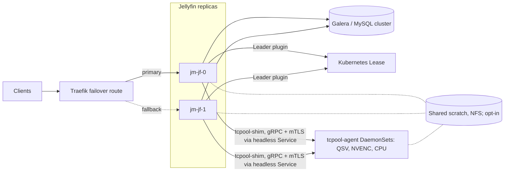

# JellyMesh

Run several Jellyfin 12.1 servers on one shared MySQL/Galera database, with a GPU transcode pool and live Dolby Vision profile 7 -> 8.1 conversion.

[](LICENSE)
[](.github/workflows/transcode.yml)
[](.github/workflows/transcode-images.yml)

I run the whole stack on one home k3s cluster ([docs/operations.md](docs/operations.md)). The Dolby Vision 7 -> 8.1 path is the piece I'd call production: it's deployed and has been playing as Dolby Vision since 2026-09-29. Everything else is code I've exercised in a lab, and [Status and limitations](#status-and-limitations) says which is which.

**Who this is for and what it needs:**

- You run Jellyfin and want more than one server behind one address, sharing one database.
- The shared database is MySQL 8.4 or Percona XtraDB Cluster. The Leader plugin and the Traefik failover route assume Kubernetes, k3s in my case.
- The transcode pool needs GPU nodes (Intel QSV or NVIDIA NVENC) or CPU workers. There's an example Traefik failover route in [deploy/examples/traefik-failover.yaml](deploy/examples/traefik-failover.yaml), explained in [docs/operations.md](docs/operations.md#traefik-activepassive-failover).

## Why

Stock Jellyfin assumes one process over one SQLite file. Running a second server runs into three problems: SQLite allows one writer, some queries perform well only on SQLite, and per-process caches go stale when another server writes.

JellyMesh addresses each of them, so any server can answer any request and the database is the only shared state. If a term here is unfamiliar, [Galera](docs/architecture.md#glossary) and the rest are in the glossary.

## Where each part lives

| Directory | Contents | Docs |
|---|---|---|
| `galera/` | Galera provider for Jellyfin, `jellyfin-dbmigrate`, lab scripts | [galera/README.md](galera/README.md) |
| `jellyfin-perf/` | Patch series against Jellyfin 12.1, including `JELLYFIN_SHARED_DB=1` | [jellyfin-perf/README.md](jellyfin-perf/README.md) |
| `leader/` | Leader plugin | [leader/README.md](leader/README.md) |
| `transcode/` | Rust GPU pool: `tcpool-shim`, `tcpool-agent`, `tcpool-sync` | [transcode/README.md](transcode/README.md) |
| `image/` | Containerfiles: hotio's Jellyfin 12.1 pinned by digest, plus the patches, provider, and migration tool | [image/README.md](image/README.md) |

## What exists

| Feature | What it does | Where it stands | Docs |
|---|---|---|---|
| Shared database provider | Runs Jellyfin 12.1 on MySQL 8.4 or Percona XtraDB Cluster | in the repo | [galera/README.md](galera/README.md) |
| `jellyfin-dbmigrate` | Lossless SQLite <-> MySQL migration in either direction, with a row-by-row verifier | in the repo | [galera/README.md](galera/README.md) |
| Query patches | Fix N+1 query shapes in people, lyrics, and dedupe, and add a Resume sort key MySQL can plan | in the repo | [jellyfin-perf/README.md](jellyfin-perf/README.md) |
| `JELLYFIN_SHARED_DB=1` | Retries user-data writes and reads user data and login sessions from the database | in the repo | [jellyfin-perf/README.md](jellyfin-perf/README.md) |
| Leader plugin | Runs scheduled tasks once, cluster-wide, using a Kubernetes Lease; outside Kubernetes the node is the leader | in the repo | [docs/operations.md](docs/operations.md) |
| Traefik active/passive failover | Lab route: primary `jm-jf-0`, fallback `jm-jf-1`, drilled once | lab only | [docs/architecture.md](docs/architecture.md#failover-behavior) |
| GPU transcode pool | `tcpool-shim` replaces ffmpeg; one agent per GPU (Intel QSV, NVIDIA NVENC) plus CPU spill; gRPC with mTLS; command allowlist | in the repo | [transcode/README.md](transcode/README.md) |
| Shared transcode directory | Replicas and agents share one scratch directory so a transcode survives replica loss; proved in the lab with 3 sessions, plaintext gRPC and one NVENC agent | in the repo, opt-in, off by default | [docs/operations.md](docs/operations.md) |
| Dolby Vision 7 -> 8.1 | Converts dual-layer profile 7 sources to profile 8.1 during HLS playback; enable with `JELLYMESH_DOVI_P7_TO_81=1` | running on my cluster since 2026-09-29, opt-in | [docs/dolby-vision.md](docs/dolby-vision.md) |
| TrueHD to EAC3 5.1 | Makes audio playable in the Android TV app on the Dolby Vision path | in the repo | [docs/dolby-vision.md](docs/dolby-vision.md) |
| Published image | `ghcr.io/saabstory404/jellymesh-jellyfin`, built manually with podman | in the repo | [docs/operations.md](docs/operations.md) |

## Dolby Vision profile 7 -> 8.1, live

JellyMesh converts dual-layer Dolby Vision profile 7 sources to single-layer profile 8.1 during HLS playback, for clients that decode single-layer Dolby Vision. It's deployed on my cluster and has been playing as Dolby Vision in the SHIELD Android TV app since 2026-09-29, and I've retested it plenty of times since.

The Jellyfin patches decide when to convert. The transcode agent rewrites the in-band RPU (the per-frame Dolby Vision metadata) to profile 8.1 and drops the enhancement layer. The HLS job uses fMP4 segments, so the init segment carries a `dvvC` box, which is the signal the app uses to show Dolby Vision.

TrueHD or MLP audio with 6 or more channels is encoded to EAC3 5.1 at 640 kb/s when the client lists `eac3`, otherwise to AAC. On 2026-09-30 I watched that EAC3 track pass through from the SHIELD to an AV receiver as Dolby Digital Plus.

Limits:

- The FEL (full enhancement layer) is dropped.
- Sources that carry the RPU in a Matroska Block Addition (`hvcE`) fall back to HDR10. Support is planned (issue #4, see [docs/ROADMAP.md](docs/ROADMAP.md)).
- HLS jobs only.
- Off by default.

Details: [docs/dolby-vision.md](docs/dolby-vision.md).

## Architecture at a glance



Solid lines are the primary path; dotted lines are the fallback route or opt-in paths. The scratch directory is shared across replicas only with `JELLYMESH_SHARED_TRANSCODE_DIR=1`, and the NFS scratch itself is an agent-side PVC (`15-scratch.yaml` in [docs/operations.md](docs/operations.md)).

Each replica runs the Galera provider, the jellyfin-perf patches, the Leader plugin, and `tcpool-shim`. The shim does nothing until `TC_WORKERS_DNS` or `TC_WORKERS` is set. Which replica gets QSV and which gets NVENC is up to you; this repo doesn't decide it. More detail: [docs/architecture.md](docs/architecture.md).

## Measured results

Every number below came from one 12-core workstation with every node running on it, and each cell is a single run. They're lab numbers, not a benchmark. Method and full tables: [docs/RESULTS.md](docs/RESULTS.md).

| Result | Value | Context | Full table |
|---|---|---|---|
| Throughput, 2 Jellyfin on 3-node Galera | 120.2 req/s vs 55.4 req/s stock SQLite | 32 clients, 9 users, 20% writes, 30 s per cell; patched SQLite reached 93.6 req/s at 32 clients | [Concurrent load](docs/RESULTS.md#concurrent-load) |
| Throughput at 1 client | SQLite wins: 44.8 vs 27.6 req/s | Patched SQLite vs patched Galera with 1 Jellyfin, 30 s per cell | [Concurrent load](docs/RESULTS.md#concurrent-load) |
| Database node killed under load | 204 requests, 0 failed, longest gap 2.9 s | SIGKILL of one Galera node, `FailOver` connection list, 3-node cluster, lab drill | [Failure drills](docs/RESULTS.md#failure-drills) |
| Cross-node coherence | Write on node A visible on node B at the first poll in 8 of 8 trials (about 40 ms); token from node B accepted on node C 150 ms later and refused on both after logout | 2 Jellyfins with `JELLYFIN_SHARED_DB=1` on the 3-node cluster | [One store versus a Redis tier](docs/RESULTS.md#one-store-versus-a-redis-response-cache-tier) and [Failure drills](docs/RESULTS.md#failure-drills) |
| `/Persons` (100 items) | 103 -> 4 SQL statements | Galera, counted from `performance_schema` | [jellyfin-perf/README.md](jellyfin-perf/README.md) |
| Audio grid (200 items) | 207 -> 8 SQL statements | Galera, counted from `performance_schema` | [jellyfin-perf/README.md](jellyfin-perf/README.md) |

The library behind those runs is a real one, 19,259 items ([test bed and limits](docs/RESULTS.md#test-bed-and-limits)). Response parity with stock is a sampled check of 14 calls; Resume and NextUp came back empty, so they aren't covered ([parity](docs/RESULTS.md#parity)).

## Quickstart

You need podman. The lab runs every node as a podman container and sets no memory limits, and I never measured how much memory the three database nodes actually want.

Pull the image. This runs nothing by itself; deployment is in [docs/operations.md](docs/operations.md).

```bash
podman pull ghcr.io/saabstory404/jellymesh-jellyfin:12.1-jm8.4
```

Run the lab from the repo root: three Galera nodes, then a Jellyfin node. Don't expect a working server out of the block below. `jf-galera.sh up` wants a prepared config directory (`JG_SRC`) and arguments these lines omit, and this repo doesn't build one for you. [docs/getting-started.md](docs/getting-started.md) is the full tutorial.

```bash
galera/lab/galera-lab.sh boot
galera/lab/galera-lab.sh join 2
galera/lab/galera-lab.sh join 3
galera/lab/galera-lab.sh db
galera/lab/jf-galera.sh up
```

## Where to go next

| I want to | Read |
|---|---|
| Evaluate the design | [docs/architecture.md](docs/architecture.md), [docs/RESULTS.md](docs/RESULTS.md) |
| Try it | [docs/getting-started.md](docs/getting-started.md) |
| Deploy it | [docs/operations.md](docs/operations.md) |
| Look up a setting | [docs/configuration.md](docs/configuration.md) |
| Debug a problem | [docs/troubleshooting.md](docs/troubleshooting.md) |
| Contribute | [CONTRIBUTING.md](CONTRIBUTING.md) |
| See what is planned | [docs/ROADMAP.md](docs/ROADMAP.md) |
| Read engineering logs | [docs/README.md](docs/README.md#engineering-records) |

The full index of pages is [docs/README.md](docs/README.md). If you've found a vulnerability, don't open an issue: [SECURITY.md](SECURITY.md) has the private reporting route. What changed under each image tag is in [CHANGELOG.md](CHANGELOG.md).

## Status and limitations

Most of what's here is code in the repo that I've run myself: the Galera provider, the jellyfin-perf patches, the Leader plugin, and the transcode pool. The Dolby Vision 7 -> 8.1 conversion is the one piece deployed on my cluster, playing as Dolby Vision since 2026-09-29. The Traefik failover, the shared transcode directory (2026-09-28), and every benchmark on this page have only been run in my lab. Sticky failover, a plugin compatibility layer, playback observability, and `hvcE` Dolby Vision sources aren't built at all yet; they're in [docs/ROADMAP.md](docs/ROADMAP.md).

Known gaps:

- Live-session state (now playing, remote control), client capabilities, and running transcodes stay per server ([docs/troubleshooting.md](docs/troubleshooting.md)).
- Plugins that keep their own SQLite files (Playback Reporting, for example) are not shared-database safe.
- Intro Skipper, Playback Reporting, and Kodi Sync Queue are blocked on the fallback server ([docs/operations.md](docs/operations.md), [docs/ROADMAP.md](docs/ROADMAP.md)).
- Failover isn't sticky yet: a viewer who failed over goes back to the primary once it's healthy, which costs two ffmpeg restarts ([docs/architecture.md](docs/architecture.md#failover-behavior)). Direct play needs a client that retries with a Range request.
- The Leader plugin only takes effect on Kubernetes, and I haven't measured how long a leader failover takes.
- The Galera provider depends on unmerged community Pomelo pull request #2047 (Pomelo is the MySQL provider for Entity Framework Core) plus a JellyMesh patch.
- The provider does not back up or restore through Jellyfin's own hooks. Back up the cluster yourself ([galera/README.md](galera/README.md)).

## License

| Component | License | Source |
|---|---|---|
| Repository | GPL-2.0 | [LICENSE](LICENSE) |
| `transcode/` Cargo workspace | MIT | `transcode/Cargo.toml` |
| `leader/` | Not declared in its project file | `leader/JellyMesh.Leader.csproj` |
| Pomelo patch | Applies to [Pomelo.EntityFrameworkCore.MySql](https://github.com/PomeloFoundation/Pomelo.EntityFrameworkCore.MySql) (MIT), built from community EF Core 10 pull request #2047 | [galera/README.md](galera/README.md) |

JellyMesh is not reviewed or endorsed by the Jellyfin project and is not affiliated with it. Jellyfin and related names and marks belong to their respective owners and are used here only to describe compatibility.
