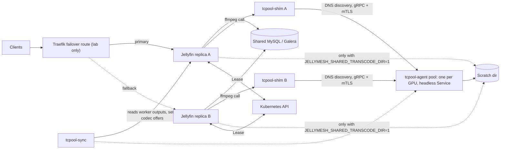
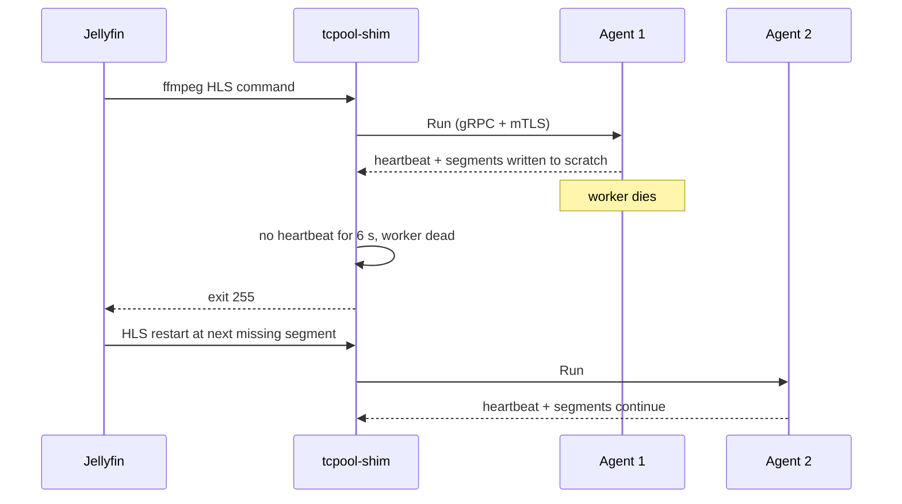

# Architecture

JellyMesh runs several Jellyfin 12.1 servers against one shared MySQL-compatible database, so any server can answer any request. This page explains how the parts fit together, why each part exists, and what happens when a node, a database member, or a GPU worker fails.

**Status:** Implemented. Only Dolby Vision 7 -> 8.1 conversion is Production (reported by the maintainer, 2026-09-29): the TV plays Dolby Vision through the Android TV app, and the EAC3 audio passes through to an AV receiver as Dolby Digital Plus (maintainer report, 2026-09-30). Per-component labels are in the [component map](#component-map).

Terms such as [Galera](#glossary) link to the [glossary](#glossary) at first use.

## How it fits together

State lives in the shared database, work runs in the GPU pool, and coordination uses a [Lease](#glossary). Each Jellyfin replica sends its reads and writes to the shared database, hands transcodes to a worker through a shim, and lets one replica run scheduled tasks. What stays per node is listed under [Shared state](#shared-state).

## Design goals

1. Any server answers any request. A client can be routed to any replica and see the same library, users, sessions, and watch state.
2. The database is the shared state. Jellyfin keeps state in SQLite and in per-process caches; JellyMesh moves the state that must agree across nodes into one database.
3. A node or a GPU can die. Database members, Jellyfin replicas, and transcode workers each have a documented failure behavior, listed in [Failover behavior](#failover-behavior).

The design does not remove all per-node state. [Shared state](#shared-state) lists what stays local.

## Component map

| Component | Directory | Role | Status |
|---|---|---|---|
| Galera provider plugin | `galera/Jellyfin.Database.Providers.Galera` | Runs Jellyfin 12.1 on MySQL 8.4 / [PXC](#glossary) through [Pomelo](#glossary) | Implemented, Lab-verified. Production use not documented |
| Pomelo build and patch | `galera/pomelo` | Builds Pomelo from community EF Core 10 PR #2047 at a pinned commit and applies `jellymesh-pomelo.patch`. No upstream Pomelo release supports EF Core 10, so the provider depends on an unmerged community PR | Implemented |
| `jellyfin-dbmigrate` | `galera/Jellyfin.DbMigrate` | Copies and verifies data between SQLite and the provider (`model`, `copy`, `verify`) | Implemented |
| Query and shared-DB patch | `jellyfin-perf/jellyfin-12.1-perf.patch` | Fixes [N+1](#glossary) query shapes, retries user-data writes, adds `JELLYFIN_SHARED_DB=1` | Implemented, lab-verified |
| Bughunt patch series 00-19 | `jellyfin-perf/bughunt` | Playback, transcode-directory, cache-invalidation, and Dolby Vision fixes; some behavior is opt-in | Implemented. Patches 13, 17-19 (Dolby Vision) Production, 2026-09-29 |
| Leader plugin | `leader` | Runs each Jellyfin scheduled task once cluster-wide using a Kubernetes [Lease](#glossary) | Implemented |
| Transcode pool | `transcode` | Rust workspace with crates `ir`, `proto`, `agent`, `shim`, `sync`, plus a C# `plugin` dashboard | Implemented. Dolby Vision path: Production, 2026-09-29. Shared transcode directory: Lab-verified, off by default |
| Container image | `image` | Layered Containerfiles (`Containerfile.jm5` to `.jm8.4`) that ship the patched Jellyfin, plugins, shim, and `jellyfin-dbmigrate` | Implemented |
| Traefik failover route | [`deploy/examples/traefik-failover.yaml`](../deploy/examples/traefik-failover.yaml) | [TraefikService](#glossary) in failover mode in front of two replicas; documented only from lab evidence | Lab-verified. Example manifest ships in `deploy/examples/` |

The Traefik route is described from measurements in [the direct-play failover report](engineering/direct-play-failover.md). The names in that report (`jm-failover`, `jm-fast-dial`) come from prose; no manifest exists in this repository.

## Request and transcode paths

Each replica runs the shim in place of ffmpeg and the leader plugin in-process. Each shim resolves the headless Kubernetes Service itself and can use any agent, so a draining or dead agent leaves DNS. An example fallback route is in [deploy/examples/traefik-failover.yaml](../deploy/examples/traefik-failover.yaml); [operations.md](operations.md#traefik-activepassive-failover) describes the lab drill behind it.

## Shared state

Setting `JELLYFIN_SHARED_DB=1` on each replica changes how Jellyfin treats its caches (source: `jellyfin-perf/README.md`, `jellyfin-perf/jellyfin-12.1-perf.patch`).

| Behavior | With `JELLYFIN_SHARED_DB=1` |
|---|---|
| User data (watch state, favorites) | Read from the database every time; no per-node LRU |
| Item cache | Entries live 5 s only. Removing the cache cost throughput in the one-store comparison (105 -> 36 req/s, `jellyfin-perf/README.md`) |
| Login sessions (Devices) | Looked up in the database instead of a startup snapshot |
| Cross-node item invalidation | [Patch 15](../jellyfin-perf/bughunt/15-shared-item-cache-invalidation.patch) adds a `JellyMeshItemInvalidation` table in the same database, created with `CREATE TABLE IF NOT EXISTS` on first use; each node polls it every 250 ms by default |
| Opt out of invalidation | `JELLYFIN_SHARED_INVALIDATION=0` |
| Poll interval | `JELLYFIN_SHARED_INVALIDATION_POLL_MS`; values under 50 fall back to 250 |

No second data store is required. The invalidation table lives in the same database as Jellyfin's data.

Measured coherence (2 Jellyfin servers on a 3-node Galera cluster, single workstation, lab):

| Test | Result | Source |
|---|---|---|
| Write on node A, read on node B | Visible at the first poll in 8 of 8 trials, about 40 ms; a stock node stayed stale after 65 s | `docs/RESULTS.md`, `jellyfin-perf/README.md` |
| Token issued on node B, used on node C | Accepted 150 ms later; refused on both right after logout | `docs/RESULTS.md`, `jellyfin-perf/README.md` |

Two constraints affect plugin authors. The series adds members to `IMediaStreamRepository`, `IMediaAttachmentRepository`, `IMediaSegmentManager`, and `IMediaSourceManager` (patch 08, non-default) and one defaulted member to `IUserDataManager` (patch 07), so third-party plugins that implement these interfaces can break. The patches target Jellyfin tag `v12.1` only and need a rebase for each new release (`jellyfin-perf/README.md`). In shared mode the startup wipe of the transcode directory deletes only files older than 6 h.

These stay per node:

| State | Effect |
|---|---|
| Live sessions (now playing, remote control) | Not visible across replicas |
| Client capabilities | Held per node |
| Running transcodes | Owned by the node that started them, unless the shared transcode directory is enabled |
| Playback progress pings | Sent to one node; a job owner's kill timer can fire while the client is served through the other replica. Patch 16 partly addresses this (cross-node ping affinity in `docs/ROADMAP.md`; from code reading and one lab incident) |
| Forgot-password PIN file | Local file on one node |
| `MaxActiveSessions` | Enforced per node, not per cluster |
| Plugins with their own SQLite (for example Playback Reporting) | Not shared-DB safe |

Sources: `README.md`, `docs/engineering/bughunt.md` (found-not-fixed items c1 and c2). Plugin compatibility work is planned in the [roadmap](ROADMAP.md). Until then Intro Skipper, Playback Reporting, and Kodi Sync Queue are blocked on the fallback server, which pauses their features during a failover (`docs/ROADMAP.md`).

## Database layer

The provider registers under the key `Jellyfin-Galera` (`GaleraDatabaseProvider.cs`). Jellyfin loads it through `database.xml` with `DatabaseType` set to `PLUGIN_PROVIDER` and `PluginName` set to `JellyMesh Galera`. The connection string is required; without it the provider throws `InvalidOperationException`.

`JELLYMESH_DB_PASSWORD`, when non-empty, overrides the password in the connection string so the secret stays out of `database.xml`. The provider logs the connection string with the password masked.

The provider pins the server version to 8.4.0 so it does not open a connection at startup. Only PXC 8.4 was run in the lab. Galera does not replicate named locks, so `GET_LOCK` cannot elect a leader; this is why the leader plugin uses a Lease. PXC with `pxc_strict_mode=ENFORCING` rejects `GET_LOCK`, which EF Core uses for its migration lock, and the lab runs `PERMISSIVE` (`galera/README.md`).

Model rules (`GaleraModel.cs`):

| Rule | Value |
|---|---|
| String collation | `utf8mb4_bin` on every string column |
| Strings in a primary key or unique index | `varchar(512)`; `ItemValues.Value` uses 700 |
| Other indexed unbounded strings | `longtext` with an index prefix of at most 255 characters |
| Primitive collections | JSON arrays in `longtext` |
| `float` and `float?` | `DOUBLE` |
| `DateTime` and `DateTime?` | `BIGINT` ticks, read back as UTC |

The provider's backup hook does not back up: `MigrationBackupFast` only sets the database character set and collation, and `RestoreBackupFast` logs that it cannot restore. Back up the cluster with your own tooling; see [Backups are your job](operations.md#backups-are-your-job).

### Single-writer and multi-writer

The original recommendation in `galera/README.md` is single-writer operation: every Jellyfin lists the nodes in the same order with `LoadBalance=FailOver`, and the other members act as synchronous standbys. Multi-writer became viable after the perf patch added a user-data retry.

| Mode | Evidence | Source |
|---|---|---|
| Single-writer | Primary kill: 206 requests, 0 failed, 2.9 s gap. Remains the conservative choice for a stock Jellyfin build | `galera/README.md`; single workstation, lab |
| Multi-writer, stock Jellyfin | 200 concurrent writes to one UserData row from different nodes gave 69 HTTP 500 responses (35%, `Deadlock found`); the same test on one node gave none | `galera/README.md`; lab drill |
| Multi-writer, patched Jellyfin | 200 of 200 writes succeeded; 120.2 req/s at 32 clients with 0 errors | `jellyfin-perf/README.md`, `docs/RESULTS.md`; single workstation, lab |

`UserDataManager.SaveUserData` retries with a fresh context and jittered backoff, 6 attempts, so multi-writer depends on the patched build. Retrying every Jellyfin transaction is not possible in the provider, because the EF Core retrying execution strategy rejects Jellyfin's `BeginTransaction`. The mode the maintainer's cluster runs is deployment-specific and not recorded here.

## Scheduled tasks

Jellyfin runs scheduled tasks on every replica. The leader plugin (`leader/LeaseLeaderService.cs`) makes one replica the holder of a `coordination.k8s.io/v1` Lease so each task runs once.

| Item | Behavior (from code reading) |
|---|---|
| Identity | `HOSTNAME`, falling back to the machine name; replicas must have different hostnames |
| Lease name | `JELLYMESH_LEASE`, default `jellyfin-tasks` |
| Lease duration | `JELLYMESH_LEASE_SECONDS`, default 15 |
| Loop tick | Every `max(1, leaseSeconds / 5)` seconds, so 3 s at the default |
| Outside Kubernetes | The node is the leader |
| Takeover | When the holder is empty, `renewTime` is missing, or the lease expired; the update carries `resourceVersion`, so a concurrent takeover receives 409 |
| Renew failure or API error | The leader steps down |
| Graceful stop | The leader clears `holderIdentity` for immediate handover |
| Library monitor | Started on the leader, stopped on followers |
| Task started on a follower | Cancelled there and forwarded through the Lease annotation `jellymesh.io/run-task` as `<task key>|<unix ms>`; the holder runs it if the worker is idle, otherwise logs a skip |
| RBAC | The pod's service account needs `get`, `create`, `update`, `patch` on `leases` in its namespace |

Forwarding is best effort with a single annotation slot, so two forwarded tasks in quick succession can overwrite each other. Without a graceful stop, leader failover takes up to the lease duration; that time is Not measured.

## Transcode pool

Stock Jellyfin runs ffmpeg as a child process on the node that serves the viewer. JellyMesh runs Jellyfin with hardware acceleration set to `none` (`transcode/README.md`) and lets the shim send the software command line to a pool of GPU workers. The base HLS path needs no Jellyfin changes; the shared transcode directory needs bughunt patches 03 and 16, and Dolby Vision needs patches 13 and 17-19.

| Part | Role |
|---|---|
| `tcpool-shim` | Installed in place of ffmpeg; HLS transcodes go to a worker, everything else runs the real ffmpeg (`TC_FFMPEG_REAL`); optional trickplay batch via `TC_BATCH=1` |
| `tcpool-agent` | One per GPU. Checks the command against an allowlist, rewrites it for its card ([QSV](#glossary), [NVENC](#glossary), or CPU), runs ffmpeg into shared scratch, refuses when full |
| `tcpool-sync` | Intersects worker outputs and sets Jellyfin's HEVC/AV1 offers to the lowest common denominator across workers (AV1 is not offered while the Tesla P4 is in the pool); serves `/metrics` and `/status` |
| `tcpool-ir` | Shared library that parses, validates, and renders ffmpeg command lines |

Discovery uses the headless Service `tcpool-agents` (port 9901 over gRPC with [mTLS](#glossary)). Each DNS record is one worker; `TC_WORKERS_DNS` on the shim points at it, and `TC_WORKERS` adds a static fallback. `publishNotReadyAddresses` is deliberately unset so a draining agent drops out of DNS. Port 9902 serves plaintext gRPC health for kubelet probes. The agent serves `/metrics` on 9903 and `tcpool-sync` serves `/metrics` and `/status` on 9904 when `TC_METRICS_PORT` is set. The [shim](#glossary) is inert when neither `TC_WORKERS_DNS` nor `TC_WORKERS` is set.

Capacity is counted in weighted capacity units, set with `TC_CAPACITY`; the agent refuses new jobs when full. Other `TC_*` variables are in the [configuration reference](configuration.md).

| Worker class | Capacity | 4K job weight | Source |
|---|---|---|---|
| Arc | 14 | 2.3 | `transcode/deploy/k8s/20-agents.yaml` |
| Tesla P4 | 6 | 2 | `transcode/deploy/k8s/20-agents.yaml` |
| CPU | 3 | 3 | `transcode/deploy/k8s/20-agents.yaml` |

The CPU worker runs at 0.18-0.59x realtime, so it serves spill work only, not playback (`docs/engineering/transcode-calibration.md`). Shared scratch must be NFS with `actimeo=1` and `lookupcache=positive`, as the manifests set; with default options new segments stayed invisible to other nodes for 12-23 s (`transcode/deploy/k8s/15-scratch.yaml`, `transcode/README.md`).

Other coordination mechanisms:

- **Per-output lease.** The agent creates `<md5>.tcpool.lock` in scratch with `O_EXCL`, so one encoder owns each output.
- **Seek affinity.** A session is pinned to its first worker through `<md5>.worker` (`TC_AFFINITY`, on by default; `TC_AFFINITY_TTL_SECS`, default 6 h).
- **Shared transcode directory.** With `JELLYMESH_SHARED_TRANSCODE_DIR=1` (patches 03 and 16), replicas share one transcode directory. Jellyfin passes `JELLYMESH_KEEPALIVE` to the shim; the agent detaches a job when its shim dies (`TC_DETACH`), heartbeats the lease, and lets a replica take over after a seek, waiting up to 8 s. Status: Implemented, off by default, Lab-verified. Lab proof (three drills, 3 sessions each, through the Traefik failover route in the lab cluster): pod delete of the serving replica, 0 failed of 162 segments; `kill -9` of the serving Jellyfin, 0 of 162; restart of the other replica, 0 of 223. Source: `transcode/docs/SHARED-TRANSCODE.md`. Two Jellyfins must not share one `TranscodingTempPath` root, and replicas need distinct `HOSTNAME`.

Dolby Vision 7 -> 8.1 conversion also runs in the agent; see [Dolby Vision conversion](dolby-vision.md). It is Production (maintainer report, 2026-09-29): the TV plays Dolby Vision. Dolby Digital Plus passthrough to an AV receiver works (maintainer report, 2026-09-30).

### Worker failure semantics

| When the worker dies | Result |
|---|---|
| Before the first segment | The shim re-runs the job on another worker; the viewer sees nothing |
| After the first segment | The shim exits 255; Jellyfin's HLS restart resumes at the next missing segment on another worker |
| Worker loses its shim | The agent fences ffmpeg within 3 s (`TC_FENCE_AFTER`) |
| Shim loses a worker | The shim treats the worker as dead after 6 s of missing heartbeat |

## Failover behavior

| Event | Outcome | Source | Test bed |
|---|---|---|---|
| Database node killed under load (SIGKILL, `FailOver` list) | 204 requests, 0 failed, longest gap 2.9 s; node Synced 7 s after restart | `galera/README.md`, `galera/lab/galera_drill.py` | Single workstation, lab, 3-node cluster |
| Single-writer primary kill | 206 requests, 0 failed, 2.9 s gap | `galera/README.md` | Single workstation, lab |
| [Direct-play](#glossary) replica hard kill (`kill -9`) | Connection reset; a client that retries with a `Range` header ([Range retry](#glossary)) recovers a byte-identical file | `docs/engineering/direct-play-failover.md` | Lab cluster, 2026-09-29, n=1 |
| Direct-play gap before recovery | 5-6 s, order of magnitude only | Same report | Lab cluster, n=1 |
| Direct-play plain `curl` after kill | About 6.2 MB of 26 MB, no resume | Same report | Lab cluster, n=1 |
| Direct-play graceful pod delete | Kestrel drains for about 21 s; one usable trial, which does not show graceful restarts are safe | Same report | Lab cluster, n=1 |
| HLS transcode, shared transcode directory | 0 failed segments in three drills (see [Transcode pool](#transcode-pool)) | `transcode/docs/SHARED-TRANSCODE.md` | Lab cluster, 3 sessions per drill |
| HLS [remux](#glossary) through a replica failover | ffmpeg restarts on the fallback and again on the primary; a Safari remux on 2026-09-27 restarted twice and the viewer reported A/V drift | `docs/ROADMAP.md` (only source; no separate report) | Lab, n=1 |
| Sticky server failover | Planned: a sticky cookie on the route, because a remux restart resumes video on a keyframe and audio at the exact second. See the [roadmap](ROADMAP.md) | `docs/ROADMAP.md` | n/a |
| Transcode worker failure | See [Worker failure semantics](#worker-failure-semantics) | `transcode/README.md`, agent and shim code | From code reading |

Direct play works with a client retry because the file is static on shared storage. The client behavior matrix in the [failover report](engineering/direct-play-failover.md) (Android TV, Moonfin, Swiftfin, Web, Infuse) was taken from public trackers, not measured.

Not measured:

- A repeated drill of HLS transcode failover behind Traefik with the default (non-shared) transcode directory; only the observations above exist.
- Leader failover time.
- Galera write stalls: there is no mysqld or wsrep exporter.

## Security model

- **Transport.** Shim-to-agent traffic uses gRPC over mTLS with a dedicated pool CA created by cert-manager (`transcode/deploy/k8s/10-tls.yaml`). Client certificates are required, and `TC_TLS_REQUIRED=1` turns missing certificates into a hard exit with code 2. The agent drains itself when its certificate files change.
- **Command allowlist.** Agents accept only ffmpeg commands whose inputs sit under `TC_INPUT_ROOTS`, reads under `TC_READ_ROOTS`, and outputs under `TC_OUTPUT_ROOT`. In the protocol suite, 134 real commands pass and 11 attacks are rejected (case 13; sources `docs/RESULTS.md` and `docs/engineering/transcode-plan.md`). The suite has 21 cases per `.github/workflows/transcode.yml`; `transcode/README.md` says the earlier count was 14, and the workflow is the newer source.
- **Database secret.** Set `JELLYMESH_DB_PASSWORD` from a Kubernetes Secret instead of writing the password into `database.xml`, which appears in config backups.
- **Unauthenticated stream endpoints in stock Jellyfin.** `/Videos/{id}/stream` and `/Audio/{id}/stream` answered range requests without a token in the failover lab (Measured). From code reading, `VideosController` has no `[Authorize]` attribute and there is no global authorization filter. An authenticated Range retry is Not measured. The example Traefik route does not restrict these paths; restricting them is up to the operator. Source: `docs/engineering/direct-play-failover.md`.
- **Logging.** Measured in the lab: Traefik access logs recorded the `api_key` query parameter in cleartext for two services (`docs/engineering/bughunt.md`). Mitigation: restrict access to those logs, or move the services to header authentication ([SECURITY.md](../SECURITY.md)).

See [SECURITY.md](../SECURITY.md) for reporting and further notes.

## Glossary

| Term | Meaning |
|---|---|
| Galera | Synchronous multi-primary replication for MySQL. A write commits on all members or fails certification |
| PXC | Percona XtraDB Cluster, a MySQL distribution with Galera. The lab uses `percona-xtradb-cluster:8.4` |
| Pomelo | `Pomelo.EntityFrameworkCore.MySql`, the EF Core provider for MySQL. JellyMesh builds it from community PR #2047 and patches it |
| N+1 | A query pattern that issues one query per row of a first query. Cheap on SQLite in-process, costly over a network |
| Lease | A Kubernetes `coordination.k8s.io/v1` object with a holder and expiry, used here for leader election |
| QSV | Intel Quick Sync Video, the hardware encoder path for Intel GPUs |
| NVENC | NVIDIA's hardware video encoder |
| mTLS | Mutual TLS: both sides present certificates |
| Direct play | The client fetches the original file unchanged |
| Remux | Repackaging streams into a new container without re-encoding video |
| Range retry | A client reissues a request with `Range: bytes=N-` after a disconnect to resume |
| HLS | HTTP Live Streaming: video served as a playlist of short segment files |
| Trickplay | Jellyfin's seek-preview thumbnails, extracted from the video by ffmpeg; the pool runs these jobs in its `batch` class |
| Seek affinity | The shim sends a seek (same output prefix, new `-start_number`) to the worker already serving that stream, instead of the least-loaded one |
| Headless Service | A Kubernetes Service with `clusterIP: None`; its DNS name returns one record per ready pod, which the shim treats as one worker each |
| PDB | PodDisruptionBudget: a Kubernetes limit on how many pods of a class a voluntary eviction may remove at once |
| RWX | ReadWriteMany: a Kubernetes volume access mode that lets pods on several nodes mount one volume |
| initContainer | A pod container that runs to completion before the main containers start |
| FK | Foreign key: a database constraint that links a row to a row in another table |
| Kestrel | The ASP.NET web server inside Jellyfin |
| TraefikService | A Traefik object that composes services, here in failover mode |
| Shim | `tcpool-shim`, the ffmpeg stand-in that forwards jobs to workers |
| Agent | `tcpool-agent`, the per-GPU worker daemon |
| Capacity units | Weighted job cost an agent accepts, set with `TC_CAPACITY` |
| PTS | Presentation timestamp, the time at which a frame or audio sample is shown |
| Keyframe | A video frame that decodes without earlier frames; a restarted video copy can only resume on one |
| Kill timer | Jellyfin's timer that stops an idle transcode job when the client stops pinging |
| HA | High availability: more than one server can answer, so one failure does not stop service |
| OTel | OpenTelemetry, a vendor-neutral format and transport for traces, metrics, and events |
| EWMA | Exponentially weighted moving average, a running average that weights recent samples more |
| Power-of-two choices | Picking the better of two randomly chosen candidates instead of scanning all of them |
| LiteFS | A replicated SQLite filesystem layer; named in the roadmap as an example only |

Dolby Vision terms (fMP4, dvvC, RPU, MEL/FEL, EL/BL) are defined in [Dolby Vision conversion](dolby-vision.md). PTS, keyframe, kill timer, HA, OTel, EWMA, power-of-two choices, and LiteFS serve other pages in this set, including the [roadmap](ROADMAP.md).

## Related docs

- [Project README](../README.md)
- [Documentation index](README.md)
- [Configuration reference](configuration.md)
- [Dolby Vision conversion](dolby-vision.md)
- [Operations](operations.md)
- [Results](RESULTS.md)
- [Roadmap](ROADMAP.md)
- [Direct-play failover report](engineering/direct-play-failover.md)
- [Bughunt report](engineering/bughunt.md)
- [transcode/README.md](../transcode/README.md)
- [galera/README.md](../galera/README.md)
- [jellyfin-perf/README.md](../jellyfin-perf/README.md)
- [Security policy](../SECURITY.md)
