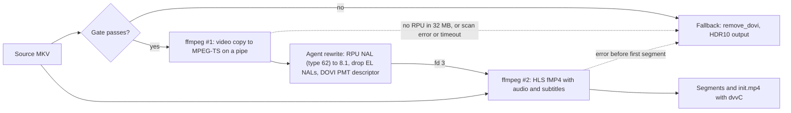

# Dolby Vision profile 7 to 8.1 conversion

JellyMesh converts Dolby Vision profile 7 (dual-layer) sources to single-layer profile 8.1 while it serves an HLS stream. Clients that decode only single-layer Dolby Vision then show the Dolby Vision badge instead of falling back to HDR10. Jellyfin decides when to convert, and the transcode pool does the conversion.

**Status:** Production (maintainer report, 2026-09-29), opt-in, off by default.

**Evidence.** The maintainer reported on 2026-09-29 that the feature is deployed in production and plays as Dolby Vision on the Android TV app on an NVIDIA SHIELD, tested repeatedly. On 2026-09-30 the maintainer reported that the EAC3 5.1 (Dolby Digital Plus) track from the TrueHD to EAC3 transcode passes through from the SHIELD to the AV receiver. Both on-device results are maintainer reports; the repository's own measurements are the lab runs in [Measurements](#measurements).

| Part | Status |
|---|---|
| Decision in Jellyfin (bughunt patches 13, 17, 18, 19) | Production, opt-in, off by default |
| Conversion in the transcode pool agent (`dv81.rs`, `dv81_ts.rs`, `dv81_plan.rs`, `job.rs`) | Production, opt-in, off by default |
| Playback as Dolby Vision on the SHIELD Android TV app | Production (maintainer report, 2026-09-29) |
| Dolby Digital Plus (EAC3 5.1) passthrough from the SHIELD to an AV receiver | Production (maintainer report, 2026-09-30) |
| Sources whose RPU sits only in a Matroska Block Addition (`hvcE`) | Planned: GitHub issue #4, see [ROADMAP.md](ROADMAP.md) |
| Direct play of profile 7 files | Not converted, by design (HLS only) |
| DTS and DTS-HD audio in fMP4 | Not measured: no DTS or DTS-HD title has been played through a converting job |
| Clients other than the Android TV app | Not measured: the Android TV app is the only client played against the conversion |

## Background

Dolby Vision profile 7 stores a base layer (BL, plain HEVC), an enhancement layer (EL), and a reference processing unit (RPU) per frame that carries the dynamic metadata. Profile 8.1 keeps only the BL and the RPU, and the BL is HDR10 compatible. Not every client decodes profile 7.

The origin of the work is in [engineering/bughunt.md](engineering/bughunt.md) (Known issue #5): about 331 movies in the maintainer's library were reported as 124 profile 7 Blu-ray remuxes, and the Android TV client on a Bravia could not direct-play them. Jellyfin then either strips Dolby Vision to HDR10 or transcodes. [engineering/transcode-plan.md](engineering/transcode-plan.md) quotes the same earlier count as 124 of 329, and neither source records the method. The newer census below counts 122 of 336.

The EL comes in two kinds. A minimal enhancement layer (MEL) adds no picture detail by definition. A full enhancement layer (FEL) carries residual detail that only a profile 7 decoder reconstructs. Converting to 8.1 drops the EL either way (see [Limitations](#limitations)).

Terms defined in the glossary at the end of [architecture.md](architecture.md#glossary): direct play, remux, fMP4, dvvC, RPU, MEL, FEL, EL, BL, NAL, mTLS. Terms defined here, on first use: HLS (HTTP Live Streaming, the segmented streaming format Jellyfin serves), TS (MPEG transport stream), PMT (the TS table that lists a program's streams), `tfdt` (the fMP4 box that holds a fragment's start time), and EAC3 (Dolby Digital Plus).

## How it works

Jellyfin decides, the pool converts. Stock Jellyfin cannot do the conversion itself: the `dovi_rpu` bitstream filter in its ffmpeg exposes only strip and compression. Measured: output of `ffmpeg -h bsf=dovi_rpu`, recorded in [engineering/bughunt.md](engineering/bughunt.md); the test image is not named there.

### Decision in Jellyfin (patch 13)

Patch 13 adds a third plan to `EncodingHelper`. It converts only when all of these hold:

1. `JELLYMESH_DOVI_P7_TO_81=1` is set on the Jellyfin server.
2. The job is HLS.
3. The source video range type is `DOVIWithEL`.
4. The client's requested range types include `DOVI` or `DOVIWithHDR10`, but not `DOVIWithEL`.

When the plan applies, Jellyfin stream-copies the video and adds the argument pair `-metadata:s:v:0 JELLYMESH_DOVI_P7_TO_81=1` to the ffmpeg command line. The marker is emitted only when the video is copied, and Jellyfin emits only this form. The pool (shim and agent) also accepts `-metadata:s:v:0 TC_DV81=1` as an alias (`DV81_SIGNAL_VALUE_ALIAS` in `transcode/crates/ir/src/lib.rs`). The arguments also keep Jellyfin's `-bsf:v hevc_mp4toannexb` and a single `-map 0:<N>` for the video ([engineering/transcode-plan.md](engineering/transcode-plan.md)).

Stock ffmpeg ignores the marker. The muxers fMP4, MPEG-TS, and MP4 accept it with exit 0, and the copied video is byte-identical to the same command without it. Measured: `cmp` of the outputs, using the jellyfin-ffmpeg image via podman on a synthetic 10-bit HEVC stream, per the comments in `jellyfin-perf/bughunt/13-dv7-to-81-decision.patch`. [engineering/bughunt.md](engineering/bughunt.md) names jellyfin-ffmpeg 8.1.2 for the same check.

Other effects of patch 13:

- The master playlist advertises `SUPPLEMENTAL-CODECS="dvh1.08.<level>/db1p"` next to the base `CODECS` entry, and describes the output as profile 8 with range type `DOVIWithHDR10` instead of the source's fields.
- `StreamBuilder` treats a `DOVIWithEL` source as `DOVIWithHDR10` for codec-profile checks (HLS transcoding profiles only), so the constrained profile wins the ranking.
- A client that declares only `DOVIWithHDR10` (no `HDR10`, no `DOVI`) is folded into the plan.
- `DOVIWithELHDR10Plus` sources are skipped. A converted profile 7 stream with HDR10+ would reach a Dolby Vision client with the RPU and HDR10+ SEI together, and that case has no measurement.

### fMP4 segments (patches 17 and 18)

A converting job gets fragmented MP4 segments even when the client's HLS profile lists TS. The init segment then carries a `dvvC` box that marks Dolby Vision, because the media3 MPEG-TS extractor reports HEVC only. Patch 17 adds `-tag:v:0 hvc1 -strict -2` to the converting job, which tags the video `hvc1` to match the `CODECS` entry.

Patch 18 removed patch 17's audio-copy gate, so fMP4 applies whether or not the audio is copied. The client's most-compatible retry (`UseMostCompatibleTranscodingProfile`, sent after a failed playback) stays on TS and gets HDR10. Non-DV jobs and TS jobs keep `-avoid_negative_ts disabled`, and mp4 segments use `make_non_negative` so AAC encoder priming does not produce a negative first `tfdt`.

### Audio (patches 18 and 19)

The Android TV app (jellyfin-androidtv v0.19.10, media3 1.8.0) cannot demux TrueHD from fragmented MP4. Measured on a SHIELD, per [engineering/bughunt.md](engineering/bughunt.md) (title: Alien: Romulus): Dolby Vision video with no audio on the TrueHD track, while AC3 worked. A converting job therefore never copies TrueHD or MLP into fMP4.

| Source audio | Result in a converting job |
|---|---|
| TrueHD or MLP, 6 or more channels | EAC3 5.1 when the client lists `eac3` and ffmpeg has the `eac3` encoder; otherwise upstream's pick (AAC 5.1 for the Android TV list). Bitrate is capped by the request's `AudioBitrate` (640 kb/s in the lab run) |
| AC3 or EAC3 | Copied, no re-encode |
| DTS or DTS-HD | Left in the client's list as-is; playback not measured |

Patch 18 removes `truehd` and `mlp` from the codec list and moves `eac3` to the front when the client offers it; if removal empties the list, it falls back to `aac`. Patch 19 fixes a defect where the EAC3 preference had no effect: `eac3` was missing from the `EncoderValidator` encoder list. The addition is detection only, and `CanEncodeToAudioCodec("eac3")` stays false, so other callers are unchanged. The patch 19 rule also requires a converting job and `(Channels ?? 6) >= 6`. Patch 18 also widens `audioCodec` list validation from 40 to 128 characters on seven `DynamicHlsController` parameters. Media3's EAC3-in-fMP4 support is From code reading (media3 1.8.0 source).

## Agent pipeline

The agent converts a job only when all five gate conditions hold:

1. The job is in the playback class (the agent's `playback` class in `job.rs`), not the `batch` class.
2. The command line carries the marker.
3. The video is stream-copied.
4. `ffprobe` reports Dolby Vision profile 7 on the source.
5. The command line has an accepted shape: exactly one `-i`, `-copyts` present, and none of `-itsoffset`, `-sseof`, `-output_ts_offset`, or an output `-ss`.

A marker on a DV5, DV8, or non-DV source therefore ends in a fallback, not in corruption.



1. `ffmpeg #1` copies the video to MPEG-TS on `pipe:1` with `-copyts -output_ts_offset 10 -muxdelay 0 -muxpreload 0`.
2. The agent (`dv81.rs`) splits each access unit into NAL units and keeps base-layer NALs byte for byte. It rewrites each RPU NAL (type 62) with the `dolby_vision` crate in `ConversionMode::To81`, which keeps the mapping for MEL and removes it for FEL. It drops EL NAL units (type 63, or `nuh_layer_id` not 0). A malformed RPU fails the whole chunk and produces no partial rewrite.
3. `dv81_ts.rs` rewrites the transport stream packet by packet and writes a single DOVI descriptor in the PMT (profile 8, BL compatibility id 1, no EL).
4. `ffmpeg #2` reads the rewritten TS on file descriptor 3, not stdin, so Jellyfin's key channel on stdin is preserved. It reads the source again for audio and subtitles, and writes Jellyfin's HLS output. `-strict` is raised to at least `unofficial`, and Jellyfin's own `-strict -2` from patch 17 is kept. Jellyfin's `-tag:v` value is kept.

### Fallbacks

Each signaled job increments one outcome of the counter `tcpool_dv81_total`. A fallback runs the original command with the marker removed and `hevc_metadata=remove_dovi=1` merged into `-bsf:v`, so the client gets HDR10 rather than raw profile 7.

| Outcome | Cause |
|---|---|
| `converted` | The RPU was rewritten and the job ran through the pipeline |
| `fallback_no_rpu` | No in-band RPU in the first 32 MB of `ffmpeg #1` output, or none in the whole output when it ends earlier (a short clip) |
| `fallback_not_p7` | `ffprobe` failed or timed out, or the source Dolby Vision profile is not 7 |
| `fallback_error` | The argument shape was not accepted, the job is not a video copy, the input is missing, `ffmpeg #1` failed to spawn, a read or rewrite failed, or `ffmpeg #1` produced no decision within 10 s |

The 32 MB limit (`DV81_SCAN_BYTES`) and the 10 s limit (`DV81_SCAN_TIMEOUT`) are fixed constants in `transcode/crates/agent/src/job.rs`, not configurable. `ffmpeg #1` is dropped with the scan (`kill_on_drop`; [engineering/transcode-plan.md](engineering/transcode-plan.md)). The 10 s scan timeout is shorter than `TC_FIRST_PROGRESS_GRACE` (default 45 s, `config.rs`), which is the only configurable value here. An error after the first segment kills `ffmpeg #2`, and Jellyfin's HLS restart takes over.

`remove_dovi` exists only in jellyfin-ffmpeg (Debian patch `0061-add-remove-dovi-hdr10plus-bsf.patch`). Stock ffmpeg fails with `Option remove_dovi not found`. Measured: Fedora ffmpeg 8.1.3 on one workstation, per [engineering/transcode-plan.md](engineering/transcode-plan.md).

The fallback output was checked on a real FEL title (Measured, lab, one title, [engineering/transcode-plan.md](engineering/transcode-plan.md)). The init segment has no DOVI record, `color_transfer=smpte2084`, bt2020, and mastering-display and content-light-level side data intact. Frame and packet counts and the A/V start match. `remove_dovi` does not delete every EL NAL: in segment 0 the EL payload fell from 6.16 MB to 3437 B, and 336 small NAL 63 units (about 10 B each) remain. The `fallback_no_rpu` gate could not be exercised on a real title, because the library has none; it was exercised only on a synthetic fixture.

### When the pool is unavailable

If the shim cannot reach the pool, or the process is not pool-eligible, the shim removes Dolby Vision itself before it runs the real ffmpeg (`dv81_local_fallback_args` in `transcode/crates/shim/src/main.rs`). The client then receives HDR10. This is the shim path this page documents; the shim's other command-line handling is described in [architecture.md](architecture.md).

If no shim is installed at all, stock ffmpeg copies raw profile 7 while the playlist advertises 8.1, which is worse than the pre-existing strip ([engineering/bughunt.md](engineering/bughunt.md), patch 13). Enable the flag only where the shim is in the transcode path.

## Enable it

1. Use the current `jellymesh-jellyfin` tag for Dolby Vision (see [operations.md](operations.md)), which contains bughunt patches 00-19. Do not use tag `12.1-jm8.2` for Android TV: it has patch 17 only and copies TrueHD into fMP4, which plays with no audio.
2. Run at least one `tcpool-agent`. Any agent build works; `image/Containerfile.jm8.4` recommends pool-r1 (`3ed52b3`). The `jellymesh-jellyfin` image already ships `tcpool-shim` as Jellyfin's ffmpeg, so no shim install is needed.
3. Set `TC_WORKERS_DNS` (or `TC_WORKERS`) on the Jellyfin container so the shim can reach the agents. The shim is inert while both are unset. See [configuration.md](configuration.md) and [operations.md](operations.md).
4. Use a jellyfin-ffmpeg build that has `remove_dovi` (needed for the fallback).
5. Set `JELLYMESH_DOVI_P7_TO_81=1` in the environment of the Jellyfin container, then restart Jellyfin.
6. Check the client profile. It must advertise `DOVI` or `DOVIWithHDR10` without `DOVIWithEL`; otherwise the plan does not apply.

The pool needs no other configuration for this feature; the agent acts on the marker.

### Roll back

Unset `JELLYMESH_DOVI_P7_TO_81` and restart Jellyfin. With the flag off, behavior is unchanged from baseline. Variables for the pool are listed in [configuration.md](configuration.md).

## Verify

1. Play a profile 7 title from a client that meets step 6 above.
2. Read the metric. The agent exposes `tcpool_dv81_total{outcome="converted"}` and the three fallback outcomes on its metrics port (`TC_METRICS_PORT`, see [configuration.md](configuration.md)). A session that converts increments `converted`.
3. Fetch the session's `init.mp4` and run `ffprobe` on it. This is the same call the end-to-end test `transcode/crates/agent/src/dv81_it.rs` makes on its converted output:

   ```bash
   ffprobe -hide_banner init.mp4
   ```

   A converted stream prints a `DOVI configuration record` with `profile: 8`, `el flag: 0`, and `compatibility id: 1` (the strings the test asserts). A plain remux of the same source shows profile 7, EL present, compatibility id 6 (`descriptor_bytes` test in `dv81_ts.rs`). With a TrueHD source and a client that lists `eac3`, the audio stream is `eac3` with an `ec-3` sample entry, 6 channels (patch 19 lab run in [engineering/bughunt.md](engineering/bughunt.md)).
4. Read the session's `master.m3u8`. It lists `SUPPLEMENTAL-CODECS="dvh1.08.<level>/db1p"`. A converting job with EAC3 audio also lists `ec-3` in `CODECS` (lab example: `CODECS="hvc1.2.4.L153.B0,ec-3"`, `SUPPLEMENTAL-CODECS="dvh1.08.06/db1p"`, from [engineering/bughunt.md](engineering/bughunt.md)).

## Measurements

Every row is Lab-verified: single-title or single-library runs on the maintainer's systems, no client matrix, and timing figures are likely page-cache warm. The on-device SHIELD result is a maintainer report and is not in this table.

| Measurement | Result | Test bed | Method | Source |
|---|---|---|---|---|
| Synthetic MEL fixture, init segment | DOVI record profile 8, level 6, compatibility id 1, `el_present_flag` 0; 96 of 96 EL NALs dropped; A/V start matches a plain remux | Workstation, Fedora ffmpeg 8.1.3, 2026-09-27 | Synthetic fixture; `dovi_tool` 2.3.4 reports Profile 7 (MEL) to Profile 8 | [engineering/transcode-plan.md](engineering/transcode-plan.md) |
| Real FEL title, 30 s window | 729 of 729 RPUs rewritten, 2459 EL NALs dropped; L1, L2, L5, L6 unchanged | One title, 23.976 fps, level 6, jellyfin-qsv image, jellyfin-ffmpeg 8.1.2, 2026-09-27 | `dovi_tool` 2.3.4 reports Profile 7 (FEL) to Profile 8 | [engineering/transcode-plan.md](engineering/transcode-plan.md) |
| Pipeline time, 30.4 s window | 1.772 s versus 1.217 s for a plain remux; 30.4 s / 1.772 s is about 17x realtime | n=1, likely warm cache, same title | Wall-clock time of the pipeline | [engineering/transcode-plan.md](engineering/transcode-plan.md) |
| Library census | 336 video files, 165 with a DOVI record, 122 profile 7 (all with in-band RPU; FEL 76, MEL 46), 43 profile 8; `hvcE`-only 0 of 122 | Maintainer's library, 2026-09-27 | 3 s scan per profile 7 title for NAL types | [engineering/transcode-plan.md](engineering/transcode-plan.md) |
| FEL visibility proxy (GitHub issue #15) | `nlq_offset` 512 on all 4 FEL titles; mean residual ratios highlight to full frame: Iron Man 1.618, Raiders of the Lost Ark 0.563, Top Gun: Maverick 0.885, WALL-E 1.393 | Four titles, one 40 s clip each (about 970 frames), highlight threshold BL luma above 600 of 1023 | Mean of the EL residual against `nlq_offset`; a proxy, not VMAF or PSNR | [engineering/gh15-fel-visibility.md](engineering/gh15-fel-visibility.md) |
| Patch 19 image `12.1-jm8.4` | Argument list `-codec:a:0 eac3 -ac 6 -ab 640000`; `dv_profile=8`; AC3 track still copied; mid-file restart continuous; non-DV title stays TS/AAC | Lab, one DV7 TrueHD title | Lab playback and `ffprobe` | [engineering/bughunt.md](engineering/bughunt.md) |
| Patch 18 lab checks | A 42-character `audioCodec` list returns HTTP 200 and a 129-character list returns HTTP 400; after a mid-file restart, segment 73 `tfdt` matches the cumulative `EXTINF` of segments 0-72; a non-DV TS job is unchanged | Lab, image `12.1-jm8.3-lab-gh14`, 2026-09-29 | HTTP requests and `ffprobe` on segments | [engineering/bughunt.md](engineering/bughunt.md) |

The FEL visibility issue is not closed. The issue text cites VMAF 99.88 and PSNR 60.8 dB, and the investigation could not retrieve or reproduce that figure, so it is unsourced. The vs-nlq reconstruction plus VMAF and PSNR comparison the issue requested was not run.

Two sources disagree on the earlier census. [engineering/bughunt.md](engineering/bughunt.md) says 124 of about 331 movies; [engineering/transcode-plan.md](engineering/transcode-plan.md) says 124 of 329 with no recorded method. This page uses the newer census, 122 of 336, from `transcode-plan.md`.

The census "hvcE mapping warning" appeared on 117 of the 122 profile 7 files, but all 122 carry in-band RPU NALs, so the warning alone does not indicate an out-of-band RPU.

More results are collected in [RESULTS.md](RESULTS.md).

## Limitations

- **The enhancement layer is dropped.** A MEL adds no picture detail by definition, so the drop is expected to cost nothing visible (From code reading, not measured). FEL sources lose the enhancement detail. Visibility on FEL titles was checked only with the residual proxy above, so the visual cost is not verified.
- **`hvcE` sources are not converted.** A profile 7 file whose RPU and EL sit in a Matroska Block Addition has no NAL 62 after stream copy. The agent detects this and falls back to HDR10. Reading Block Additions is planned (GitHub issue #4, see [ROADMAP.md](ROADMAP.md)). In the maintainer's library the class is 0 of 122.
- **The source is read twice.** `ffmpeg #1` reads the video and `ffmpeg #2` reads audio and subtitles, so a converting session reads more of the source storage than a plain remux. The size of the difference and the cold-cache cost are Not measured.
- **HLS only.** Direct play and progressive streams are not converted.
- **`DOVIWithELHDR10Plus` sources are not converted** (see patch 13 above).
- **Client coverage.** The documented client is the official Android TV app (v0.19.10, media3 1.8.0) on a SHIELD. A client whose device profile lists only literal `DOVI` (not `DOVIWithHDR10`) does not win the ranking through the conversion.

## Tests and tools

| Item | Location | Notes |
|---|---|---|
| Jellyfin-side tests | `EncodingHelperDoviTests`, `StreamBuilderDoviP7ToP81Tests`, `StreamBuilderDoviP7ToP81Fmp4Tests`, added by `jellyfin-perf/bughunt/13-dv7-to-81-decision.patch` through `19-dv81-fmp4-eac3-encoder.patch` | Run with the bughunt build (`BUGHUNT=1 ./jellyfin-perf/build.sh`) |
| Agent unit tests | `dv81.rs` (6 tests), `dv81_ts.rs` (5), `dv81_plan.rs` (9) | Counts from grep of `#[test]` at the time of writing; they drift |
| End-to-end test | `transcode/crates/agent/src/dv81_it.rs` | Builds a synthetic profile 7 MEL fixture in the test (x265 10-bit plus AAC, no binary asset). Skips with a note on stderr when ffmpeg, ffprobe, or libx265 is missing; the fallback tests also skip when the local ffmpeg lacks `remove_dovi` |
| Stand-alone filter | `transcode/crates/agent/examples/dv81_filter.rs` | Reads TS on stdin and writes rewritten TS on stdout; optional argument is the DV level (default 6) |

Run the agent tests from `transcode/` with `cargo test`, as in [CONTRIBUTING.md](../CONTRIBUTING.md). The filter usage, from the example's header, is a template: replace `src.mkv` and the final ffmpeg arguments with your own.

```bash
ffmpeg -i src.mkv -map 0:v:0 -c:v copy -copyts -output_ts_offset 10 \
  -muxdelay 0 -muxpreload 0 -f mpegts - \
  | dv81_filter [level] \
  | ffmpeg -f mpegts -i - <output arguments>
```

## Related docs

Reference and explanation:

- [architecture.md](architecture.md): how the shim, agents, and Jellyfin fit together, and the glossary
- [configuration.md](configuration.md): `JELLYMESH_DOVI_P7_TO_81` and the pool variables
- [RESULTS.md](RESULTS.md): all measurements
- [ROADMAP.md](ROADMAP.md): planned work, including `hvcE` support

How-to:

- [operations.md](operations.md): image tags and the transcode pool
- [troubleshooting.md](troubleshooting.md): symptoms and fixes

Engineering records:

- [engineering/bughunt.md](engineering/bughunt.md): patch series 00-19, including the full patch 13, 17, 18, and 19 records
- [engineering/transcode-plan.md](engineering/transcode-plan.md): design and measurement log for the pool
- [engineering/gh15-fel-visibility.md](engineering/gh15-fel-visibility.md): FEL visibility proxy
