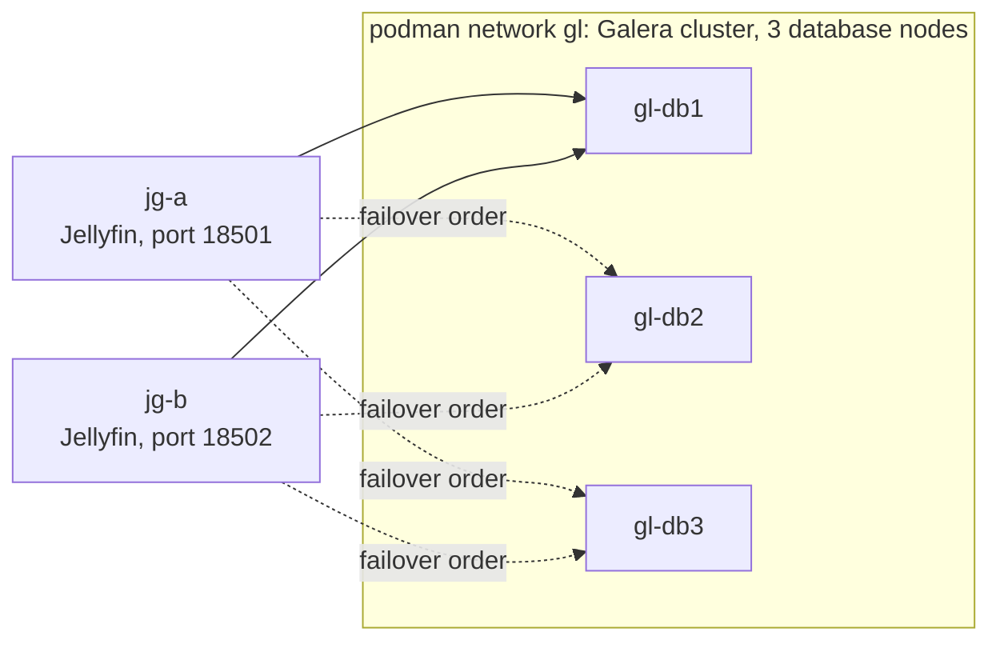

# Getting started: two Jellyfin servers, one database

This tutorial builds a three-node Galera cluster and two Jellyfin 12.1 servers on one Linux machine, then checks that both servers see the same state. The one input you supply yourself is a prepared Jellyfin config directory (see [What you build and what you need](#what-you-build-and-what-you-need)).

The scripts in `galera/lab/` are lab tooling: hard-coded credentials, every node a podman container on one host. The numbers quoted here are small-sample runs on that one workstation, and [Results](RESULTS.md) gives the method behind each figure. The Dolby Vision 7 -> 8.1 conversion rides in the same patch series and has been running in production on my cluster since 2026-09-29, but it isn't part of this tutorial; see [dolby-vision.md](dolby-vision.md).

> [!WARNING]
> You won't get through Steps 5 to 7 without a prepared Jellyfin config directory (`JG_SRC`), and this repository doesn't say how to prepare one. Budget a from-source build of Pomelo and Jellyfin, several GB of downloads and container images, and a long first build.

The steps, in order:

1. Build the Pomelo fork.
2. Build the provider plugin.
3. Build the patched Jellyfin overlay.
4. Start the Galera cluster.
5. Load a library into Galera.
6. Start two Jellyfin servers.
7. Verify shared state.
8. Optional: verify or reverse a migration.

## What you build and what you need

You end with this layout on one machine:



Both Jellyfin servers list the database nodes in the same order, so they use `gl-db1` and fall over to `gl-db2`, then `gl-db3`, when it dies. Galera is a synchronous multi-master replication layer for MySQL, and Percona XtraDB Cluster (PXC) is the MySQL distribution used here. Anything else unfamiliar is in the [glossary](architecture.md#glossary).

| You need | Why |
|---|---|
| Linux, `podman`, `git`, `openssl`, `curl` | The lab scripts run every node as a podman container and generate a CA with `openssl` |
| .NET 10 SDK | The provider, the migration tool and the patched Jellyfin all target `net10.0` |
| Python 3 with `requests` | The drill scripts import `requests` |
| Network access to GitHub, NuGet, Docker Hub and ghcr.io | Builds clone `sufficit/Pomelo.EntityFrameworkCore.MySql` and `jellyfin/jellyfin`; containers pull `percona/percona-xtradb-cluster:8.4` and `hotio/jellyfin:release-12.1` |
| A prepared Jellyfin config directory, exported as `JG_SRC` | `jf-galera.sh` copies it for each node |
| MySQL or PXC 8.4 | The version is fixed in code, and PXC 8.4 is the only one I've run in the lab |

The lab is not a deployment recipe. For non-lab use, supply the database password through `JELLYMESH_DB_PASSWORD` instead of `database.xml`, use TLS, and keep the password in a Secret. Production MySQL or PXC settings (grants, sizing, backup) are up to you; nothing here ships them. A `GET_LOCK` cannot elect a leader on Galera, which is why the `leader/` plugin uses a Kubernetes Lease instead. See [operations.md](operations.md).

The prepared config directory is the one input this repository does not create. `jf-galera.sh` wants a config with scheduled tasks emptied and the lab API key `jmlabkey0000000000000000000000001` present, and it defaults to `~/.cache/dbsidecar/s`. Building that directory is on you; nothing here scripts it.

The lab values are fixed in the scripts:

| Value | Setting |
|---|---|
| Database root password | `labroot`, override with `GL_ROOTPW` (the drill and reset scripts do not read it and always use `labroot`) |
| Jellyfin database user | `jellyfin` / `jellyfin` on database `jellyfin` |
| Jellyfin API key | `jmlabkey0000000000000000000000001` |

Do not reuse these values outside a lab.

## Step 1: build the Pomelo fork

Pomelo is the MySQL provider for Entity Framework Core (EF Core, the .NET database layer Jellyfin uses). Upstream has no EF Core 10 release, so the project builds a pinned community branch and applies its own patch.

```bash
galera/pomelo/build.sh
```

The script clones `https://github.com/sufficit/Pomelo.EntityFrameworkCore.MySql.git`, checks out commit `14a6e2897e6f7d16272c687e3ff17265eae38fe4` (branch `upgrade/10.0.0`, upstream PR #2047), applies `galera/pomelo/jellymesh-pomelo.patch`, and builds `src/EFCore.MySql/EFCore.MySql.csproj` in Release. Output goes to `~/.cache/jellymesh-vendor/pomelo`, and the script writes the pinned SHA and patch name to a `SOURCE` file there.

| Variable | Default | Effect |
|---|---|---|
| `POMELO_SRC` | `~/.cache/jellymesh-vendor/pomelo-src` | Where the fork is cloned |
| `POMELO_OUT` | `~/.cache/jellymesh-vendor/pomelo` | Where the build is written |

The build passes `-p:NuGetAudit=false` because a transitive build-time package, `Microsoft.Build.Tasks.Git`, carries a security advisory the repository treats as an error. That package does not ship in the output.

If you set `POMELO_OUT`, pass the same directory as `-p:PomeloBin=<dir>` in Step 2. The provider project reads `PomeloBin` and defaults to `$(HOME)/.cache/jellymesh-vendor/pomelo`.

## Step 2: build the provider plugin

The provider plugin lets Jellyfin store its data in MySQL. Jellyfin loads it through `database.xml` with `DatabaseType` set to `PLUGIN_PROVIDER`.

```bash
dotnet build -c Release galera/Jellyfin.Database.Providers.Galera
```

That builds clean with the .NET 10 SDK and puts the output in `galera/Jellyfin.Database.Providers.Galera/bin/Release/net10.0/`. The Step 5 tool build uses the same layout. You pass the provider directory to the lab script as `JG_PLUGIN` in Step 6. The provider targets EF Core 10.0.11, MySqlConnector 2.5.0 and `Jellyfin.Database.Implementations` 12.1.0.

A normal build leaves out assemblies the Jellyfin server already loads. Setting `JmDesign=true` keeps them, and the csproj says that is needed only to run `dotnet ef migrations add`. You don't set it for this tutorial.

## Step 3: build the patched Jellyfin overlay

The overlay is a set of seven rebuilt Jellyfin assemblies that the lab mounts over the stock image. They carry the query fixes, the bughunt patch series (numbered patches 00 to 19 for stability, playback and Dolby Vision) and the opt-in shared-database mode; see [jellyfin-perf/README.md](../jellyfin-perf/README.md). The patch targets Jellyfin tag `v12.1` (ee91c75) only.

```bash
BUGHUNT=1 ./jellyfin-perf/build.sh
```

The script clones `jellyfin/jellyfin` into `$JF_SRC`, checks out tag `v12.1`, cleans the tree, applies `jellyfin-12.1-perf.patch` and then every `bughunt/NN-*.patch` in numeric order, and builds `Jellyfin.Server` in Release. `BUGHUNT=0` skips the series; the default is `1`.

| Variable | Default | Effect |
|---|---|---|
| `JF_SRC` | `~/.cache/jellymesh-vendor/jellyfin-src` | Where `jellyfin/jellyfin` is cloned and patched |
| `JF_OVERLAY` | `~/.cache/jellymesh-vendor/jellyfin-perf` | Where the seven built assemblies are copied |
| `BUGHUNT` | `1` | `0` skips the bughunt series |

All seven assemblies are copied to `$JF_OVERLAY` either way, regardless of `BUGHUNT`: `Emby.Server.Implementations`, `Jellyfin.Server.Implementations`, `MediaBrowser.Controller`, `MediaBrowser.MediaEncoding`, `MediaBrowser.Model`, `Jellyfin.Api` and `jellyfin`.

The series has three opt-in features: shared-database mode (`JELLYFIN_SHARED_DB=1`), the shared transcode directory (`JELLYMESH_SHARED_TRANSCODE_DIR=1`) and Dolby Vision 7 -> 8.1 (`JELLYMESH_DOVI_P7_TO_81=1`). This tutorial turns on only `JELLYFIN_SHARED_DB`, through `JG_SHARED` in Step 6. The Dolby Vision path is the one piece I run in production (since 2026-09-29, opt-in), and it needs the transcode pool in the ffmpeg path; without it, stock ffmpeg copies raw profile 7 while the playlist advertises 8.1. See [dolby-vision.md](dolby-vision.md) and [configuration.md](configuration.md). Patches 07 and 08 add interface members, so plugins that implement those interfaces break.

## Step 4: start the Galera cluster

`galera/lab/galera-lab.sh` runs `docker.io/percona/percona-xtradb-cluster:8.4` nodes on a podman network named `gl`.

```bash
galera/lab/galera-lab.sh boot
galera/lab/galera-lab.sh join 2
galera/lab/galera-lab.sh join 3
galera/lab/galera-lab.sh db
galera/lab/galera-lab.sh status
```

| Command | What it does |
|---|---|
| `boot` | Creates the network, starts `gl-db1` as the bootstrap node, waits until it reports `Synced` |
| `join <n>` | Starts `gl-db<n>` as a joiner of `gl-db1` and waits for `Synced` |
| `db` | Creates database `jellyfin` (`utf8mb4` / `utf8mb4_bin`) and user `jellyfin` |
| `status` | Prints `wsrep_cluster_size`, `wsrep_local_state_comment` and `wsrep_ready` for each running node |
| `rejoin <n>` | Removes node `n` (keeping its data volume) and restarts it as a joiner of a live node |
| `down` | Removes all `gl-db*` containers and their data volumes |

Once the three nodes have joined, `status` should show a cluster size of 3 and `Synced` for each node. Node `n` publishes MySQL on host port `1330n`, so node 1 is on `13301`.

The script generates a lab CA and server certificate in `~/.cache/galera-lab/certs` (override with `GL_CERTS`) and mounts a `jellymesh.cnf` into each node. Two settings in that file matter:

- **`pxc_strict_mode=PERMISSIVE`.** EF Core takes its migration lock with `GET_LOCK`, which strict mode rejects on PXC because Galera does not replicate named locks. Run migrations from one node.
- **`tmp_table_size=256M`.** At the 16M default, Jellyfin's `DISTINCT` grids spill temporary tables to disk. The script comment records two on-disk temporary tables for an Audio grid count and a 60 ms saving at 256M. I measured that in my lab when I wrote the script and haven't re-run it for this page.

The nodes also start with `--innodb-buffer-pool-size=768M --max-connections=500`.

## Step 5: load a library into Galera

`jf-galera.sh up` deletes the copied SQLite file and points Jellyfin at Galera, and its readiness poll uses the lab API key. So the database has to hold the prepared library before the nodes start. `jellyfin-dbmigrate` copies a SQLite Jellyfin database into Galera and verifies the copy.

> [!WARNING]
> `copy` never calls the provider's `MigrationBackupFast`, so it does not set the database default collation; `galera-lab.sh db` in Step 4 is what creates the database with `utf8mb4_bin`. It deletes all rows in every non-empty target table, so the target must be empty or disposable. And it needs the provider project, so build Pomelo (Step 1) first. Outside the lab the provider and the migration tool come prebuilt: the published `jellymesh-jellyfin` image ships the provider under `/opt/jellymesh/plugins/JellyMesh Galera_1.0.0.0/` and a self-contained `/opt/jellymesh/jellyfin-dbmigrate`. See [operations.md](operations.md).

First, get the SQLite provider assembly from the Jellyfin 12.1 image. It is not on NuGet, and the migration tool references it from `$(JellyfinBin)`, which defaults to `~/.cache/jellymesh-vendor`. The csproj comment gives the `podman cp` form; the `podman create` and `podman rm` lines are this page's wrapper around it, and the image is the `JG_IMG` default:

```bash
mkdir -p ~/.cache/jellymesh-vendor
podman create --name jf-dll-src ghcr.io/hotio/jellyfin:release-12.1
podman cp jf-dll-src:/usr/lib/jellyfin/bin/Jellyfin.Database.Providers.Sqlite.dll ~/.cache/jellymesh-vendor/
podman rm jf-dll-src
```

Then build the tool. As in Step 2, this is the plain `dotnet build`; the assembly name `jellyfin-dbmigrate` comes from the csproj.

```bash
dotnet build -c Release galera/Jellyfin.DbMigrate
```

Copy the library. Jellyfin must be stopped, which it is at this point. The lab layout puts the SQLite file at `data/data/jellyfin.db` inside the config directory, and the connection string below is the one `galera/lab/reset_data.py` uses against node 1.

```bash
JG_SRC=${JG_SRC:-$HOME/.cache/dbsidecar/s}
CONN='galera:Server=127.0.0.1;Port=13301;Database=jellyfin;Uid=jellyfin;Pwd=jellyfin;SslMode=Disabled;AllowPublicKeyRetrieval=true'
galera/Jellyfin.DbMigrate/bin/Release/net10.0/jellyfin-dbmigrate copy   --from "sqlite:$JG_SRC/data/data/jellyfin.db" --to "$CONN"
galera/Jellyfin.DbMigrate/bin/Release/net10.0/jellyfin-dbmigrate verify --from "sqlite:$JG_SRC/data/data/jellyfin.db" --to "$CONN"
```

`copy` runs the target provider's migrations, copies every table in foreign-key order with its original keys, and carries over Jellyfin's code-migration history. It writes batches of 1000 rows. `verify` prints one line per table and ends with `verify: every row and column identical`; it exits with code 1 if any row differs. Exit codes are 0 on success, 1 when `verify` finds differences and 2 on a usage error. The binary path is the default .NET output layout, as noted in Step 2.

## Step 6: start two Jellyfin servers

`galera/lab/jf-galera.sh up <name> <host-port> <database-nodes>` copies `$JG_SRC` to a per-node directory under `~/.cache/galera-lab/jf-<name>`, installs the provider, writes `database.xml`, and starts a container `jg-<name>` on the `gl` network. It then polls the API until it answers.

```bash
export JG_PLUGIN=$PWD/galera/Jellyfin.Database.Providers.Galera/bin/Release/net10.0
export JG_OVERLAY=$HOME/.cache/jellymesh-vendor/jellyfin-perf
export JG_SHARED=1
galera/lab/jf-galera.sh up a 18501 gl-db1,gl-db2,gl-db3
galera/lab/jf-galera.sh up b 18502 gl-db1,gl-db2,gl-db3
```

| Variable | Default | Effect |
|---|---|---|
| `JG_PLUGIN` | none | Directory with the built provider (Step 2). Required on the first `up` of a node, when `database.xml` is written |
| `JG_OVERLAY` | none | Directory of rebuilt Jellyfin DLLs, each mounted read-only over `/usr/lib/jellyfin/bin/` (Step 3) |
| `JG_SHARED` | none | `1` sets `JELLYFIN_SHARED_DB=1` in the container (shared-database mode) |
| `JG_SRC` | `~/.cache/dbsidecar/s` | Prepared config directory to copy |
| `JG_IMG` | `ghcr.io/hotio/jellyfin:release-12.1` | Jellyfin image |
| `JG_LAB` | `~/.cache/galera-lab` | Lab state directory |
| `JG_PW_ENV` | none | `1` removes `Pwd=` from `database.xml` and passes `JELLYMESH_DB_PASSWORD` instead |

The script also reads `JG_SQLITE`, `JG_MESH`, `JG_REDIS` and `JG_RC` for comparison and Redis experiments. The mesh plugin they refer to (`mesh/meta.json`) isn't in this repository, so leave them unset.

The script writes this `database.xml` for each node:

```xml
<?xml version="1.0" encoding="utf-8"?>
<DatabaseConfigurationOptions xmlns:xsi="http://www.w3.org/2001/XMLSchema-instance" xmlns:xsd="http://www.w3.org/2001/XMLSchema">
  <DatabaseType>PLUGIN_PROVIDER</DatabaseType>
  <LockingBehavior>NoLock</LockingBehavior>
  <CustomProviderOptions>
    <PluginName>JellyMesh Galera</PluginName>
    <PluginAssembly>Jellyfin.Database.Providers.Galera.dll</PluginAssembly>
    <ConnectionString>Server=gl-db1,gl-db2,gl-db3;Database=jellyfin;Uid=jellyfin;Pwd=jellyfin;SslMode=Disabled;AllowPublicKeyRetrieval=true;LoadBalance=FailOver</ConnectionString>
  </CustomProviderOptions>
</DatabaseConfigurationOptions>
```

`LoadBalance=FailOver` makes the MySQL connector use the first reachable server in the list and move on when it dies. Keep the list in the same order on every Jellyfin server. That gives you single-writer behavior, which is the conservative default: the other database nodes are synchronous standbys. The patched build retries user-data writes on a certification conflict, and I did measure multi-writer with it: 200 of 200 writes succeeded, where stock Jellyfin returned HTTP 500 on 35% of concurrent writes. The drill is under "Single-writer or multi-writer" in `docs/engineering/galera-provider.md`. The plugin folder is named `JellyMesh Galera_1.0.0.0`.

| Command | What it does |
|---|---|
| `up <name> <host-port> <database-nodes>` | Copies `$JG_SRC`, installs the provider, writes `database.xml`, starts `jg-<name>` |
| `reload <name> <host-port>` | Copies a rebuilt provider into a running server and restarts its container |
| `down` | Removes every `jg-*` container |

## Step 7: verify shared state

The three checks below run against server A (`jg-a`, `http://localhost:18501`) and server B (`jg-b`, `http://localhost:18502`). Each block shows the shape of the output to look for; exact wording is in the scripts.

### Write on A, read on B

```bash
python3 galera/lab/galera_drill.py consistency http://localhost:18501 http://localhost:18502
```

The drill toggles an item's played state through A, reads the row straight from `gl-db3`, then reads B's API and prints B's value right after A's write. It then polls B at 1, 5, 30 and 65 seconds, stops at the first poll that matches the target, and restores the item afterwards. Both the `gl-db3 row` and the `B's API right after` lines should match the target value, and the second should end in `consistent`.

```text
item '<name>': played False -> True via A (<n> ms)
  gl-db3 row right after A's 200: Played=1   (expected 1)
  B's API right after: Played=True   (consistent)
```

| Setup | Result | Source |
|---|---|---|
| Two Jellyfins, `JELLYFIN_SHARED_DB=1`, 3-node Galera | Write on A visible on B at the first poll, 8 of 8 runs, about 40 ms including the poll | `jellyfin-perf/README.md`; 9 users, 20% writes, single workstation |
| Same, default per-node caches | B still stale after 65 s | `jellyfin-perf/README.md`, `docs/engineering/galera-provider.md` |

I measured those with a polling harness that isn't in this repository, and I haven't re-run it for this page. The drill above checks the same behavior at coarser timing.

### Sign in on A, use the token on B

```bash
python3 galera/lab/auth_drill.py http://localhost:18501 http://localhost:18502
```

The drill creates a throwaway user, logs in on A, calls `/Users/Me` on both nodes with that token, logs out on A and calls both again. Expect `200` on both servers before logout and `401` (`refused`) on both after it:

```text
200 on both servers before logout, 401 (refused) on both after logout
```

On a single workstation with 2 Jellyfins against a 3-node Galera cluster and `JELLYFIN_SHARED_DB=1`, I measured a token issued on B being accepted on C 150 ms later (`jellyfin-perf/README.md`). A stock node answers `401` to a token issued elsewhere.

### Kill a database node

```bash
python3 galera/lab/galera_drill.py failover http://localhost:18501 gl-db1 30
```

The drill sends a small read every 100 ms, sends `podman kill` to `gl-db1` five seconds in, and reports every failed request and the longest gap between successes. It then starts the container again and waits up to 300 seconds for `Synced`. IST (incremental state transfer) is how a restarted node catches up on the writes it missed.

| Drill | Result | Source |
|---|---|---|
| SIGKILL of B's Galera node under load, `FailOver` list | 204 requests, 0 failed, longest gap 2.9 s, node `Synced` 7 s after restart (IST) | `docs/engineering/galera-provider.md`, 2026-09, single workstation |
| SIGKILL of the primary in single-writer mode (a separate scenario) | 206 requests, 0 failed, 2.9 s gap | `docs/engineering/galera-provider.md`, same setup |

Those come from drills of the same kind, not from this exact command line (30 s, victim `gl-db1`), so your numbers will differ. `gl-db1` is the bootstrap node and the first node in the list, so killing it is what exercises the failover. Node 1 has to come back as a joiner: if the drill reports that it did not rejoin, run `galera/lab/galera-lab.sh rejoin 1`. A node that restarts with its bootstrap settings refuses to start.

Check the cluster afterward with `galera/lab/galera-lab.sh status`.

## Step 8 (optional): verify or reverse a migration

The migration tool works in both directions. Use it on a real server with Jellyfin stopped, and keep the original SQLite file until you have checked the result.

| Mode | Usage |
|---|---|
| `model` | `jellyfin-dbmigrate model --from <db>` lists tables, row counts and shadow properties |
| `copy` | `jellyfin-dbmigrate copy --from <db> --to <db>` |
| `verify` | `jellyfin-dbmigrate verify --from <db> --to <db>` |

A `<db>` is `sqlite:<path>` or `galera:<connection string>`. To back out, copy in the other direction to a new file and move it into place, then delete `database.xml`; Jellyfin defaults to SQLite. Don't pass `--probe`: as the last argument it is ignored and a full `copy` runs. `verify` compares exact DateTime ticks.

| Measurement | Result | Source |
|---|---|---|
| SQLite to 3-node Galera, 19,259 items, 308,330 rows, 31 tables | 46.2 s, verify identical | `docs/engineering/galera-provider.md`, 2026-09-26, single workstation |
| Galera to new SQLite, same library | 28.2 s, round trip identical | `docs/engineering/galera-provider.md`, same setup |

On this provider, Jellyfin's pre-migration backup only sets the database collation to `utf8mb4_bin` and takes no backup, and restore logs a critical message and restores nothing. That is what `GaleraDatabaseProvider.cs` does; I haven't watched it fail. Back up and restore the cluster yourself.

## Clean up

```bash
galera/lab/jf-galera.sh down
galera/lab/galera-lab.sh down
```

`jf-galera.sh down` removes every `jg-*` container. `galera-lab.sh down` removes every `gl-db*` container and its data volume. Neither removes the per-node config directories under `~/.cache/galera-lab/` or the certificates, and those files belong to the container user. This removes the two per-node config directories and nothing else under `~/.cache/galera-lab/`:

```bash
podman unshare rm -rf ~/.cache/galera-lab/jf-a ~/.cache/galera-lab/jf-b
```

## Next steps

- Run the same design on a cluster: [operations.md](operations.md) covers images, database setup, the HA route, the leader plugin and the transcode pool.
- Add GPU transcoding and Dolby Vision 7 -> 8.1: [dolby-vision.md](dolby-vision.md) and the transcode pool section of [operations.md](operations.md).
- Run the unit tests with `dotnet test -c Release galera/Jellyfin.Database.Providers.Galera.Tests` (12 xunit tests; the lab tests need `JELLYMESH_TEST_DB`).
- When a step doesn't behave the way this page says it should, [troubleshooting.md](troubleshooting.md) maps symptoms to causes and fixes.

## Limitations

- Load benchmarks are not reproducible from this repository alone. The `spikes/` and `mesh/` directories that older documents refer to are not in the repository.
- Tools in `galera/tools/`: `ddl_audit.py` (lists `varchar` columns and indexes that include `longtext` columns), `digest_profile.sh` (statements and server time per call), `slow_sql.py` (captures and explains the slowest SELECTs of one call), `parity_ab.py` (compares responses from two nodes) and `stmt_counts.py`. `stmt_counts.py` imports from the absent `spikes/` directory and cannot run as shipped. `galera/lab/reset_data.py` restores pristine data before a benchmark.
- Per-node state stays per node: live sessions, client capabilities and running transcodes. Plugins that keep their own SQLite file are not shared-database safe. `JELLYFIN_SHARED_INVALIDATION=0` opts out of the shared cache invalidation (patch 15).
- At 1 client SQLite is faster than Galera, 45 against 28 req/s. On the same single workstation, shared mode came out at 90.7 req/s with 8 clients and 112.0 req/s with 32 ([jellyfin-perf/README.md](../jellyfin-perf/README.md)).
- Oracle's `MySql.EntityFrameworkCore` was dropped after it truncated indexed strings and had other faults, so the provider uses the Pomelo fork.
