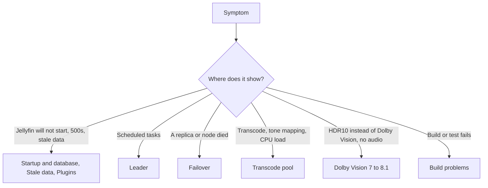

# Troubleshooting

This page maps symptoms on a running or half-built JellyMesh deployment to a likely cause, a check, and a fix. Each section ends with a Sources line naming the repo files the rows come from.

**Status:** Implemented. Dolby Vision 7 -> 8.1 rows: Production (maintainer report, 2026-09-29), opt-in, off by default. Rows marked "From code reading", "Not measured" or "Planned" say so in the row.

Terms are defined in the glossary at the end of [architecture.md](architecture.md). Variable names and defaults are in [configuration.md](configuration.md). Procedures such as installing plugins or rolling back are in [operations.md](operations.md). The tables have four columns: what you see, the likely cause, a check, and the fix. The Build problems section is for contributors.

## Start here

## Startup and database

| Symptom | Likely cause | Check | Fix |
|---|---|---|---|
| `InvalidOperationException`: `database.xml must set CustomProviderOptions/ConnectionString for Jellyfin-Galera` | The provider found no connection string. `Jellyfin-Galera` is the provider key; `database.xml` selects it with `DatabaseType` `PLUGIN_PROVIDER` and `PluginName` `JellyMesh Galera`. | Open `database.xml` and look for `CustomProviderOptions` with a `ConnectionString`. | Set `ConnectionString`. The password may come from `JELLYMESH_DB_PASSWORD` instead of the string. |
| Migration fails with `GET_LOCK` errors on Percona XtraDB Cluster (PXC) | `pxc_strict_mode=ENFORCING` rejects `GET_LOCK`, which EF Core's migration lock uses. | Generic check: `SHOW VARIABLES LIKE 'pxc_strict_mode'` on the node. | The lab generates `pxc_strict_mode=PERMISSIVE` and migrates from one node; use the same setting while migrations run. Galera does not replicate named locks, so `GET_LOCK` cannot elect a leader; the [Leader plugin](operations.md) uses a Kubernetes Lease instead. |
| Tables or comparisons behave differently from the lab; wrong collation | The lab database is created as `utf8mb4` / `utf8mb4_bin`. On start, `MigrationBackupFast` runs `ALTER DATABASE ... CHARACTER SET utf8mb4 COLLATE utf8mb4_bin`, and the model sets `utf8mb4_bin` on every string column. | Generic check: read `DEFAULT_COLLATION_NAME` for the `jellyfin` schema in `information_schema.SCHEMATA`. | Create the database as `utf8mb4` / `utf8mb4_bin`. The `dbmigrate` `copy` mode does not create the database or set its collation (From code reading). |
| Jellyfin's own pre-migration backup or restore does nothing useful | `MigrationBackupFast` does not back up and `RestoreBackupFast` logs a Critical "cannot restore" message. | Look for the Critical log line. | Back up the cluster yourself (the code comment names xtrabackup). Keep the old SQLite file when migrating. |
| HTTP 500 `Deadlock found` on concurrent user-data writes from different nodes | Multi-writer Galera certification conflicts. Lab, n=1 drill before the retry patch: 200 concurrent writes to one UserData row across nodes gave 69 HTTP 500 (35%); the same node gave 0. | Search logs for `Deadlock found`. | Apply `jellyfin-perf/jellyfin-12.1-perf.patch`. It retries user-data saves with a fresh context and jittered backoff, 6 attempts; the same drill gave 200 of 200 successes. Single-writer (all nodes list the servers in the same order with `LoadBalance=FailOver`) stays the conservative choice for a stock Jellyfin build. |
| Many new database connections; `/health` opens a connection per probe | Pomelo's stock creator opened a new unpooled connection on each `CanConnect`. Lab: 1.00 new connection per `/health` call before the fix (see [RESULTS.md](RESULTS.md)). | Compare `Threads_connected` across a series of `/health` calls. | Use image `12.1-jm7.1` or later. `GaleraDatabaseCreator` runs `SELECT 1` on the pooled connection. |
| Password visible in logs | Before jm7, a quoted password containing `;` was not fully masked. | Search the log for the connection string. | Use image `12.1-jm7` or later, which redacts quoted passwords containing `;`. Set `JELLYMESH_DB_PASSWORD` (from a Kubernetes Secret) so the password stays out of `database.xml`, which is in config backups. |
| Errors after a database node dies | Inferred: the connection string lists one node. | Check `Server=` in the connection string. | List all nodes in the same order on every Jellyfin, with `LoadBalance=FailOver`. Lab, n=1: SIGKILL of a node under load gave 204 requests, 0 failed, longest gap 2.9 s; the node was Synced 7 s after restart. |
| After SIGKILL of the bootstrap node in single-writer mode, the node does not return | The bootstrap node must come back as a joiner. | Node state in the lab. | Run `galera/lab/galera-lab.sh rejoin <n>`. The script's usage text omits this command. |
| Lab node fails state transfer with `Could not find a CA file` | The xtrabackup transfer needs one CA shared by all lab nodes. | Compare the CA files the nodes use. | Use one CA for all nodes (the lab script does this). |

Sources: `galera/README.md`, `galera/lab/galera-lab.sh`, `galera/Jellyfin.Database.Providers.Galera/GaleraDatabaseProvider.cs`, `galera/Jellyfin.Database.Providers.Galera/GaleraDatabaseCreator.cs`, `galera/Jellyfin.DbMigrate/Program.cs`, `jellyfin-perf/README.md`, `image/Containerfile.jm7`, `image/Containerfile.jm7.1`.

## Stale data across nodes

| Symptom | Likely cause | Check | Fix |
|---|---|---|---|
| A change on node A is not visible on node B for about 65 s | Default per-node caches. Lab: B stayed stale after 65 s (see [RESULTS.md](RESULTS.md)). | Read the same item from both nodes. | Set `JELLYFIN_SHARED_DB=1` on every node. User data is then read from the database, the item cache keeps entries 5 s only, and login sessions are looked up in the database. Lab: a write on A was visible on B at the first poll (about 40 ms, 8 of 8 tries). |
| Shared mode is on but item changes still lag | Patch 15 invalidation is off or polling slowly. | Check `JELLYFIN_SHARED_INVALIDATION` (`0` opts out) and `JELLYFIN_SHARED_INVALIDATION_POLL_MS`. | Leave `JELLYFIN_SHARED_INVALIDATION` unset. The poll defaults to 250 ms and values under 50 fall back to 250. The table `JellyMeshItemInvalidation` is created with `CREATE TABLE IF NOT EXISTS` on first use. |
| A login token from node B is refused on node C with HTTP 401 | Without shared mode the token list is a startup snapshot per node. | Repeat the request on the issuing node. | Enable `JELLYFIN_SHARED_DB=1` on all nodes. Lab: a token issued on B was accepted on C 150 ms later and refused on both right after logout on B. |
| Now-playing, remote control, or running transcodes differ between nodes | Live sessions, client capabilities, and running transcodes stay per node in shared mode. | Query `/Sessions` on each node. | Known gap, not a fault. See [ROADMAP.md](ROADMAP.md). |
| Forgot-password PIN not accepted on another node | Unverified source-read finding `c1`: the PIN is written to a node-local JSON file, and the redeem request can land on another node. The cross-node claim rests on deployment notes. | Compare the node that handled the forgot-password request with the node that handled the redeem, in the Jellyfin logs. | No fix ships in this repository. An administrator can set the user's password from the Jellyfin dashboard instead. |
| Session cap exceeded across nodes | Unverified source-read finding `c2`: `MaxActiveSessions` is checked against a per-process dictionary, so a user can exceed the cap by splitting sessions across replicas. | Count a user's sessions on each node. | No fix ships in this repository; the cap is enforced per node only. |

Sources: `jellyfin-perf/README.md`, `jellyfin-perf/bughunt/15-shared-item-cache-invalidation.patch`, `image/Containerfile.jm7`, `docs/engineering/bughunt.md` (c0-c2, single pass, not adversarially verified).

## Plugins

| Symptom | Likely cause | Check | Fix |
|---|---|---|---|
| `BadImageFormatException`, "Bad IL range", on a live replica after a plugin update | A DLL was overwritten in place under a running process. Reproduced in the podman lab. | Look for the exception in the Jellyfin log after a plugin copy. | Install with `image/install-plugins.sh`. It skips identical DLLs (`cmp`) and otherwise copies to `<dll>.jmnew` and renames it, so the file gets a new inode. It prints `jellymesh: updated <name>/<dll>` or `jellymesh: installed <name>`, which you can use to confirm the run. |
| The database provider is not loaded | The plugin folder name does not match. The name contains a space: `JellyMesh Galera_1.0.0.0`. | List `${JELLYFIN_DATA_DIR:-/config/data}/plugins`. | Run `image/install-plugins.sh` as an init container. It copies `/opt/jellymesh/plugins/*/*.dll` into `<data dir>/plugins/<name>`. |
| Playback Reporting, Intro Skipper, or Kodi Sync Queue do not work on the fallback server | These plugins are blocked on the fallback server today. Plugins with their own SQLite are not shared-DB safe. | Compare the plugin on the primary and the fallback. | Planned: the plugin compatibility layer in [ROADMAP.md](ROADMAP.md). |
| A web client keeps showing an old Jellyfin Web version | Stale service worker. | Look for the throttled stale-version warning in the Jellyfin log. | Patch 12 sets `Cache-Control: no-cache` on `serviceworker.js` and logs the warning. |

Sources: `image/install-plugins.sh`, `image/Containerfile.jm7`, `docs/ROADMAP.md`, `docs/engineering/bughunt.md` (patch 12).

## Leader (scheduled tasks)

The Leader plugin holds a Kubernetes Lease so scheduled tasks run once. Defaults: lease name `jellyfin-tasks` (`JELLYMESH_LEASE`), duration 15 s (`JELLYMESH_LEASE_SECONDS`), loop tick `max(1, leaseSeconds/5)` s, so 3 s at the default. See [operations.md](operations.md) for setup.

| Symptom | Likely cause | Check | Fix |
|---|---|---|---|
| Tasks never run on any node | The ServiceAccount cannot use Leases. Any API error makes a leader step down. | Look for Leader log errors from the Kubernetes API. | Grant `get`, `create`, `update`, `patch` on `leases` (API group `coordination.k8s.io`) in the pod's namespace. |
| Tasks run on every node | Not in Kubernetes. A node counts as in-cluster only when `KUBERNETES_SERVICE_HOST` is set and the ServiceAccount token file exists; otherwise the node is the leader. | Check both conditions inside the pod. | Run the replicas as pods with a mounted ServiceAccount token. |
| Lease flaps between replicas, or two replicas act as one holder | Replicas share the same `HOSTNAME`, which is the lease identity (fallback: machine name). | Compare `HOSTNAME` across replicas. | Give each replica a distinct `HOSTNAME` (a StatefulSet does). Shared transcode mode also needs distinct values. |
| Tasks pause after the leader dies | From code reading: the lease must expire before another node takes over, so the worst case is the lease duration plus one loop tick. A graceful stop clears `holderIdentity` for immediate handover. Leader failover time is Not measured. | Watch the Lease `renewTime`. | Wait. Lowering `JELLYMESH_LEASE_SECONDS` shortens the wait and the tick (`leaseSeconds/5`, minimum 1). |
| A task started on a follower does not run, and the follower's run is cancelled | The follower cancels its run and forwards it through the Lease annotation `jellymesh.io/run-task`. The holder runs it only if its worker is Idle; otherwise it logs `forwarded task <key> skipped (state <state>)`. | Grep the holder's log for `skipped`. | Start the task again when the holder is idle. Forwarding is best effort: the annotation is one slot, so two forwarded tasks close together can overwrite each other (From code reading). |
| A follower's library monitor runs for the first 30 s | Jellyfin starts the monitor itself; the plugin stops it on followers once more than 30 s have passed since startup. | Compare the time since startup. | Wait 30 s. |

Sources: `leader/LeaseLeaderService.cs`, `transcode/docs/SHARED-TRANSCODE.md`.

## Failover

| Symptom | Likely cause | Check | Fix |
|---|---|---|---|
| A direct-play stream stops when the serving replica is killed | A direct-play stream is one long HTTP connection, and Traefik failover cannot re-home a response already started. One lab run (n=1): a hard kill reset the connection, and plain `curl` had about 6.2 MB of 26 MB and did not resume. | Check whether the client retries with a `Range` header. | Use a client that does a Range retry. Evidence: a retrying client got 206 from the other replica and a byte-identical file, with a gap of about 5-6 s (n=1, order of magnitude only). Behavior of specific apps is Not measured. |
| Feature-length direct-play streams are cut during a rolling restart | A graceful pod delete drains in-flight requests for about 21 s, then SIGKILL. | Compare the stream length with the drain window. | The Range-retry client is needed for rolling restarts too. `/Videos/{id}/stream` and `/Audio/{id}/stream` answer without auth in stock Jellyfin, so a retry needs no new token. |
| An HLS transcode restarts after failover | Failover restarts ffmpeg. | Watch for a new ffmpeg process on the other replica. | Accept the restart, or enable the opt-in shared transcode mode (`JELLYMESH_SHARED_TRANSCODE_DIR=1`, patches 03 and 16; off by default, Lab-verified, see [operations.md](operations.md)). |
| `kubectl` `RESTARTS` does not increase after killing the Jellyfin process | s6-overlay is PID 1 and respawns the process inside the container. | Watch readiness-probe events, or `ps` inside the pod. | Use those instead of the restart counter. |
| ffmpeg restarts twice, once on failover and again when the primary returns | No sticky failover. A failed-over viewer goes back to the primary as soon as it is healthy. | Watch ffmpeg starts. | Planned: sticky cookie on the route, see [ROADMAP.md](ROADMAP.md). |
| Audio drifts after failover in Safari | Measured 2026-09-27: a Safari remux (video copy, DTS to AAC) restarted on the fallback and again on the primary about 3 min later, and the viewer reported drift. | Two ffmpeg starts for one session in the shim log. | Planned: sticky failover. |
| Jellyfin process crash when the database fails over | The `UserDataChangeNotifier` crashed the process on a database failure. | Look for the crash after a database node dies. | Patch 14 (`jellyfin-perf/bughunt/14-userdata-notifier-db-failover-crash.patch`). |
| `api_key` query parameter visible in Traefik access logs (logging note) | Traefik logs the query string of two lab services in cleartext. | Read the access log. | Move those services to header-based auth, or scrub the field in the log pipeline. A Jellyfin patch cannot fix it. |

Sources: `docs/engineering/direct-play-failover.md`, `docs/engineering/bughunt.md`, `docs/ROADMAP.md`, `transcode/docs/SHARED-TRANSCODE.md`.

## Transcode pool

Ports: 9901 gRPC over mTLS, 9902 plaintext gRPC health, 9903 agent `/metrics` (only when `TC_METRICS_PORT` is set; the manifests set 9903), 9904 sync `/metrics` and `/status` (only when `TC_METRICS_PORT` is set on the sync sidecar; the manifests set it). See [configuration.md](configuration.md) for every `TC_*` variable.

| Symptom | Likely cause | Check | Fix |
|---|---|---|---|
| Transcodes run in local ffmpeg, not on the pool | The shim is inert when `TC_WORKERS_DNS` and `TC_WORKERS` are unset. It also runs local ffmpeg for anything other than HLS transcodes; trickplay reaches the pool only with `TC_BATCH=1` and an output under `TC_TRICKPLAY_OUTPUT_ROOT` (see the trickplay row below). | Check the shim env and `/config/log/tc-shim.log`. | Set `TC_WORKERS_DNS=host[:port]`, a headless Service where each A/AAAA record is one worker. `TC_WORKERS=name=host:port,...` is a static fallback. |
| Shim logs `tls misconfigured ... running LOCALLY` and every session is CPU-encoded; the agent exits 2 | The `/tls` secret is not readable by uid 1000. | Check the secret mount. | Mount `/tls` read-only with `defaultMode: 0440` and set `fsGroup: 1000` on the pod. |
| Shim cannot start the real ffmpeg | `TC_FFMPEG_REAL` must exist. Default: `/usr/lib/jellyfin-ffmpeg/ffmpeg.real`. | Generic check: list that path in the Jellyfin container. | Move the real ffmpeg to `ffmpeg.real` and put the shim in its old place, as the image does. |
| The agent refuses a job because of the allowlist | The command failed validation. Inputs must be under `TC_INPUT_ROOTS`, reads under `TC_READ_ROOTS`, outputs under `TC_OUTPUT_ROOT`. | Read the refusal in the shim log and the `TranscodePolicyRefusals` alert. | Align the roots with the paths Jellyfin uses. CI runs the allowlist tests on every change under `transcode/`: `cargo test --locked` runs the corpus test (`crates/ir/tests/corpus_validate.rs`, 67 lab and 67 production commands accepted) and the `rejects_attacks` unit test in `crates/ir/src/validate.rs`, and protocol case 13 checks an out-of-root job is refused (`.github/workflows/transcode.yml`). |
| The agent refuses a job as full | Capacity units are exhausted. `TC_CAPACITY` sets units; without it `TC_MAX_JOBS` applies, else 1000 units (effectively unbounded). Weights: `TC_WEIGHT_1440` 2.0, `TC_WEIGHT_4K` 3.0, `TC_WEIGHT_COPY` 0.25, applied only when `TC_CAPACITY` is above 0. | Metrics `tcpool_capacity_units`, `tcpool_units_used`, `tcpool_jobs_active`. | Add a worker or raise capacity. The shipped DaemonSets use Arc 14, P4 6, CPU 3 units. |
| A session moves workers or restarts | The worker lost its shim and fenced ffmpeg within 3 s (`TC_FENCE_AFTER`), or the shim treated the worker as dead after 6 s. Before the first segment the shim re-runs elsewhere; after it, the shim exits 255 and Jellyfin's HLS restart resumes at the next missing segment. | Shim log and `tcpool_jobs_total{outcome}`. | Expected for a lost worker. If it repeats for one worker, check that worker's pod and network. The agent stall check is `TC_STALL_AFTER` (default 20 s). |
| Segments written by one node are invisible on another for 12-23 s | Default NFS mount options (lab measurement, see [transcode-calibration.md](engineering/transcode-calibration.md)). | Generic check: the mount options on the scratch volume. | Mount with `nfsvers=4.2`, `lookupcache=positive`, `actimeo=1`, as in `transcode/deploy/k8s/15-scratch.yaml`. |
| The agent exits with code 2 at startup, TLS variables missing | `TC_TLS_REQUIRED=1` is set and `TC_TLS_CERT`, `TC_TLS_KEY`, `TC_TLS_CA` are missing. | Environment and mounted certificate files. | Provide the certificates (`transcode/deploy/k8s/10-tls.yaml` issues them through cert-manager) or unset `TC_TLS_REQUIRED` for a plaintext lab. |
| Health probes fail on TLS | Kubelet probes cannot speak mTLS. | Probe target port. | Probe port 9902 (`TC_HEALTH_PORT`, default 9902 when TLS is on), plaintext gRPC health. |
| Transcode temp files vanish at startup | Two Jellyfins share one `TranscodingTempPath` root, so one's startup wipe deletes the other's files. | Compare paths across replicas. | Give each Jellyfin its own root, or use shared mode (`JELLYMESH_SHARED_TRANSCODE_DIR=1`), where the startup wipe deletes only files older than 6 h. |
| HTTP 500 to two viewers at once on a fresh transcode directory | Race on the `.jellyfin-transcode` marker. The pool deploy leaves the marker `root:root 0644` on purpose so Jellyfin's startup wipe cannot delete it. | Generic check: list the marker's ownership. | Leave the root ownership alone. |
| Trickplay generation is refused | `TC_TRICKPLAY_OUTPUT_ROOT` is unset, and unset means refused. | Agent env. | Set `TC_TRICKPLAY_OUTPUT_ROOT`, and `TC_BATCH=1` on the shim. |
| Tone mapping ignores the UI algorithm on Intel Arc | Arc uses `tonemap_vaapi` with a fixed curve; UI algorithm, peak, and desaturation are ignored. | Compare output with the UI setting. | Known limit. Honoring the setting is Planned in [transcode-plan.md](engineering/transcode-plan.md). |
| Playback stutters on the CPU worker | Lab measurement (single job, x264/x265 `-preset slow` at 8 Mbps, [transcode-calibration.md](engineering/transcode-calibration.md)): 0.18-0.59x realtime. The shipped CPU worker uses a different setting, and its realtime speed is Not measured. | `tcpool_job_speed` below 1.0 (alert `TranscodeJobsSlow`). | Prefer the GPU workers for playback; treat the CPU worker as spill or batch capacity. |

Sources: `transcode/crates/shim/src/main.rs`, `transcode/crates/agent/src/main.rs`, `transcode/crates/agent/src/config.rs`, `transcode/crates/sync/src/metrics.rs`, `transcode/crates/proto/src/tls.rs`, `transcode/deploy/CONTRACT.md`, `transcode/deploy/alerts.yaml`, `transcode/deploy/k8s/`, `transcode/README.md`.

## Dolby Vision 7 -> 8.1

Verify a session with the agent metric `tcpool_dv81_total{outcome=...}` (outcomes `converted`, `fallback_no_rpu`, `fallback_not_p7`, `fallback_error`) or with `ffprobe` on the init segment (`ffprobe -hide_banner init.mp4`; a converted stream prints a `DOVI configuration record` with `profile: 8`, `el flag: 0`, and `compatibility id: 1`). See [dolby-vision.md](dolby-vision.md) for the full description.

**No Dolby Vision badge.** Check these conditions in order (patch 13):

1. `JELLYMESH_DOVI_P7_TO_81=1` is set on Jellyfin.
2. The client's range types include `DOVI` and `DOVIWithHDR10` and do not include `DOVIWithEL`.
3. The job is HLS.
4. The source is `DOVIWithEL`. A source that is `DOVIWithELHDR10Plus` is never converted.

Flag off leaves behavior unchanged.

| Symptom | Likely cause | Check | Fix |
|---|---|---|---|
| `tcpool_dv81_total{outcome="fallback_no_rpu"}` increases | The agent found no RPU NAL (type 62) in the first 32 MB of the copied video. Sources that carry the RPU only in a Matroska Block Addition (`hvcE`) contain none; reading them is not implemented (issue #4). | The metric; `ffprobe` on the source. | Planned. The client gets HDR10. In one library census, 0 of 122 profile 7 files were `hvcE`-only (maintainer's library, 2026-09-27). |
| `tcpool_dv81_total{outcome="fallback_error"}` increases | The agent made no decision within 10 s, the source is not a video stream copy, or the plan failed. The agent gate also requires exactly one `-i` and `-copyts`; other argv shapes fall back (`transcode/deploy/CONTRACT.md`). | The agent log and the metric. | The client gets HDR10. Fix the argv shape if you produce your own transcode arguments. |
| HDR10 plays instead of Dolby Vision | The job took a fallback: `fallback_not_p7` (the source is not profile 7, or the `ffprobe` check on the source failed or timed out), `fallback_no_rpu`, or `fallback_error`. In every fallback the remux still runs with Dolby Vision removed, so the client gets HDR10 rather than raw profile 7. | The `tcpool_dv81_total` outcome. | Run `ffprobe` on the source and see the rows above. |
| Dolby Vision video but no sound on Android TV | TrueHD in fMP4. The Android TV app (media3 1.8.0) cannot demux TrueHD from fragmented MP4. Measured on a SHIELD: video plays, no audio on the TrueHD track; AC3 worked. Image `12.1-jm8.2` (patch 17 only) copies TrueHD; the `jm8.3` build (`12.1-jm8.3-lab-gh14`, a lab tag) does not encode EAC3. | Image tag. | Use image `12.1-jm8.4` (patches 17-19). When eligible (flag on, converted job, mp4 segments, a TrueHD or MLP source with 6 or more channels, the client lists eac3), it encodes EAC3 5.1 at 640 kb/s capped by the URL's `AudioBitrate`; otherwise AAC. AC3 and EAC3 sources are copied. |
| HTTP 400 on `master.m3u8` | The `audioCodec` list is longer than the cap. The Android TV list is 42 characters; before patch 18 the cap was 40, and now it is 128 (a 129-character list still returns 400). | Length of the `audioCodec` query value. | Use image `12.1-jm8.4`, or the `jm8.3` lab build `12.1-jm8.3-lab-gh14`, which carry patch 18. |
| Raw profile 7 stream, glitches on a TV | The flag is set but no shim is in the transcode path, so stock ffmpeg copies raw profile 7 while the playlist advertises 8.1. | Generic check: the ffmpeg path in the Jellyfin container should be the shim. | Set `JELLYMESH_DOVI_P7_TO_81` only where the shim is installed. If the shim is present but the pool is unreachable, the shim removes DV instead (HDR10). |

The EAC3 track passes through from the SHIELD to an AV receiver as Dolby Digital Plus (maintainer report, 2026-09-30; patch 19 row in [bughunt.md](engineering/bughunt.md)). DTS-HD in fMP4 on media3 is Not measured. The older marker `TC_DV81=1` is still accepted as an alias for the current marker.

Sources: `docs/engineering/bughunt.md` (patches 13, 17, 18, 19), `docs/dolby-vision.md`, `transcode/crates/agent/src/job.rs`, `transcode/crates/agent/src/dv81.rs`, `transcode/crates/shim/src/main.rs`, `transcode/deploy/CONTRACT.md`, `image/Containerfile.jm8.3`, `image/Containerfile.jm8.4`.

## Build problems

For contributors.

| Symptom | Likely cause | Check | Fix |
|---|---|---|---|
| Pomelo build fails on a NuGet audit advisory | A transitive build-time package has an advisory that is treated as an error. | Build output. | `galera/pomelo/build.sh` passes `-p:NuGetAudit=false`. Use the script. |
| Provider build cannot find the Pomelo DLL | `$(PomeloBin)` defaults to `$(HOME)/.cache/jellymesh-vendor/pomelo`. | List that directory. | Run `galera/pomelo/build.sh` first, or set `POMELO_OUT`. |
| `dotnet test` reports analyzer mismatches | The Debug analyzer set does not match. | Configuration. | `dotnet test -c Release galera/Jellyfin.Database.Providers.Galera.Tests` |
| Tests named `*_Lab_*` pass without exercising anything | They run only when `JELLYMESH_TEST_DB` holds a MySQL or Galera connection string; otherwise they return immediately and pass. | Whether `JELLYMESH_TEST_DB` is set. | Start the lab (`galera/lab/galera-lab.sh`) and set `JELLYMESH_TEST_DB` to a lab connection string (`galera-lab.sh db`). |
| musl build fails while compiling C code | The `ring` crate compiles C. | Build output. | Install `musl-tools`, or set `CC_x86_64_unknown_linux_musl=gcc`. `transcode/deploy/build-musl.sh` builds in a container by default; `TC_BUILD=host` uses the host toolchain. |
| `galera/tools/stmt_counts.py` fails to import | The script adds a `spikes/jellymesh` path to `sys.path` but imports nothing from it; the only third-party import is `requests`. | Run `python3 galera/tools/stmt_counts.py --help`. | Install the Python `requests` package. |
| Image build cannot find its context | Containerfiles expect a staging directory (overlay, provider, static musl binaries) that is not in the repo. | `image/Containerfile.jm8.4` header comments. | Build the overlay with `BUGHUNT=1 ./jellyfin-perf/build.sh` and the binaries with `transcode/deploy/build-musl.sh`. The staging directory is deployment-specific and not shipped here; the header comment of each Containerfile lists what it expects. |
| Provider does not load after a Jellyfin upgrade | The provider builds against `Jellyfin.Database.Implementations` 12.1.0. | Jellyfin version. | Rebuild the provider after a Jellyfin upgrade. MySQL 8.0 is untested. |

Sources: `galera/pomelo/build.sh`, `galera/README.md`, `galera/Jellyfin.Database.Providers.Galera/Jellyfin.Database.Providers.Galera.csproj`, `jellyfin-perf/build.sh`, `transcode/README.md`, `transcode/deploy/build-musl.sh`, `galera/tools/stmt_counts.py`, `image/Containerfile.jm8.4`.

## Where to look

| Item | Location | Source |
|---|---|---|
| Shim log | `/config/log/tc-shim.log` (`TC_SHIM_LOG`) | `transcode/crates/shim/src/main.rs` |
| Agent health | Port 9902, plaintext gRPC health | `transcode/deploy/CONTRACT.md` |
| Agent metrics | Port 9903, `/metrics`, only when `TC_METRICS_PORT` is set (the manifests set it) | `transcode/crates/agent/src/main.rs`, `transcode/deploy/k8s/20-agents.yaml` |
| Sync metrics and status | Port 9904, `/metrics` and `/status` JSON, only when `TC_METRICS_PORT` is set (the manifests set it) | `transcode/crates/sync/src/metrics.rs`, `transcode/deploy/k8s/30-service.yaml` |
| Pool alerts | `transcode/deploy/alerts.yaml` | `transcode/deploy/alerts.yaml` |
| Agent log | Standard output and standard error of the agent process (the container log in Kubernetes) | `transcode/crates/agent/src/main.rs` (`log`) |
| Galera or wsrep metrics | No exporter in the deployment | `docs/engineering/bughunt.md` |
| Known issues | Issue numbers such as #4 and #14 appear in [ROADMAP.md](ROADMAP.md) | `docs/ROADMAP.md` |

## Related docs

- [architecture.md](architecture.md) for the parts and the glossary
- [configuration.md](configuration.md) for environment variables and defaults
- [operations.md](operations.md) for installation, upgrade, and rollback
- [dolby-vision.md](dolby-vision.md) for the Dolby Vision 7 -> 8.1 feature
- [RESULTS.md](RESULTS.md) for the measurements cited here
- [ROADMAP.md](ROADMAP.md) for planned fixes
