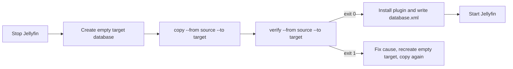

# JellyMesh Galera provider and jellyfin-dbmigrate

A Jellyfin 12.1 database provider plugin for MySQL 8.4 and Percona XtraDB Cluster (PXC), so several Jellyfin servers can share one database. It ships with `jellyfin-dbmigrate`, a tool that moves a Jellyfin database between SQLite and that provider in either direction and verifies the result.

## Status

**Status:** Implemented; Lab-verified. Production deployment of the provider is deployment-specific and not recorded here.

| Part | Status | Qualifier |
|---|---|---|
| Provider plugin (`Jellyfin.Database.Providers.Galera`) | Implemented | Code is in the repo. |
| Provider behavior on a real library (migration, drills, parity) | Lab-verified | Single workstation, all nodes in podman containers; results measured 2026-09-26. See [measurements](../docs/engineering/galera-provider.md). |
| `jellyfin-dbmigrate` (`model`, `copy`, `verify`) | Implemented | Round trip verified in the lab. |
| Pomelo build with `jellymesh-pomelo.patch` | Implemented | Depends on an unmerged community pull request. |
| Lab scripts and analysis tools | Implemented | Lab use only. |

## What it does

[Galera](../docs/architecture.md#glossary) is a synchronous multi-primary replication layer for MySQL: every node holds a full copy of the database and a commit is certified cluster-wide before it returns. PXC is Percona's MySQL distribution with Galera built in. The provider lets several Jellyfin servers share one such database instead of each keeping its own SQLite file.

Jellyfin loads the provider through `database.xml` with `DatabaseType=PLUGIN_PROVIDER`. The plugin name is `JellyMesh Galera`, the plugin directory is `JellyMesh Galera_1.0.0.0`, and the provider registers itself in code under the key `Jellyfin-Galera`.

The provider is built on EF Core (Microsoft's object-relational mapper, which Jellyfin uses) and Pomelo (the community MySQL driver for EF Core). Behavior below is From code reading of `GaleraDatabaseProvider.cs`, `GaleraDatabaseCreator.cs`, and `GaleraModel.cs`.

### Connection and logging

| Area | Behavior |
|---|---|
| Connection | Requires `CustomProviderOptions/ConnectionString`; otherwise throws `InvalidOperationException`. |
| Server version | Fixed `MySqlServerVersion` of 8.4.0, so no connection is opened to detect the version at startup. |
| Password | If `JELLYMESH_DB_PASSWORD` is non-empty, it replaces the `Password` in the connection string. This keeps the password out of `database.xml`, which ends up in config backups. |
| Logging | The connection string is logged with the password masked as `*****`. |
| Warnings | The provider ignores EF Core's `NonTransactionalMigrationOperationWarning` and `MultipleCollectionIncludeWarning`. |

### Model rules

| Area | Behavior |
|---|---|
| String collation | Every string column uses `utf8mb4_bin`. |
| Indexed strings, keys | When Jellyfin leaves the length unset, strings in a primary key or unique index become `varchar(512)` (`ItemValues.Value` gets 700). |
| Indexed strings, other | When Jellyfin leaves the length unset, other indexed unbounded strings become `longtext`. An index that contains a `longtext` column gets a prefix length of min(255, (3072 - fixed bytes) / 4 / text column count). |
| Collections | The provider sets `EnablePrimitiveCollectionsSupport`, so queries over captured `Guid[]` and list parameters translate. The model's own list columns (for example `KeyframeTicks`, a `List<long>`) keep explicit JSON converters and are stored as JSON arrays in `longtext`, the same format SQLite uses. |
| Floating point | `float` and `float?` map to `DOUBLE`, because MySQL `FLOAT` read over the text protocol loses digits. |
| Time | `DateTime` and `DateTime?` map to `BIGINT` ticks and are read back as UTC. |
| Model hook | The rules run as a model-finalizing convention, because `JellyfinDbContext` calls the provider's `OnModelCreating` before its own configuration. |

### Hooks and maintenance

| Area | Behavior |
|---|---|
| Health probe | `GaleraDatabaseCreator` replaces Pomelo's creator so `CanConnect` runs `SELECT 1` on the context's pooled connection (1.00 new connection per `/health` probe without it; measured in the lab, n=1). `Exists`, `Create`, and migrations are unchanged. |
| Backup and restore | The provider's backup and restore hooks are no-ops. `MigrationBackupFast` takes no backup and logs a warning; `RestoreBackupFast` logs a Critical "cannot restore" message; `DeleteBackup` and `RunShutdownTask` do nothing. |
| Collation hook | Jellyfin calls `MigrationBackupFast` before it runs migrations. The hook runs `ALTER DATABASE ... CHARACTER SET utf8mb4 COLLATE utf8mb4_bin`. |
| Optimization | The scheduled optimization runs `ANALYZE TABLE` on every mapped table. |
| Purge | `PurgeDatabase` deletes table contents with `FOREIGN_KEY_CHECKS=0` on a connection it opens explicitly, because `ConnectionReset=false` would leave the setting on the pooled session. It re-enables the checks in a `finally` block, clears the connection pool if re-enabling fails, and runs the `SET` statements even when no tables are given. |

## Requirements

| Item | Version | Source |
|---|---|---|
| Jellyfin | 12.1 | `Jellyfin.Database.Implementations` 12.1.0 and `Jellyfin.Common` 12.1.0 in the provider csproj |
| .NET | 10 (`net10.0`) | provider and tool csproj files |
| EF Core | 10.0.11 | provider csproj |
| MySqlConnector | 2.5.0 | provider csproj |
| MySQL or PXC | 8.4 | The server version is hard-coded to 8.4.0; only PXC 8.4 (`percona/percona-xtradb-cluster:8.4`) was run in the lab. |
| Pomelo.EntityFrameworkCore.MySql | Community EF Core 10 PR #2047 at a pinned commit, plus `pomelo/jellymesh-pomelo.patch` | `pomelo/build.sh` |
| Container runtime | podman, for the lab scripts and for extracting the SQLite provider DLL | `lab/*.sh` |

Production MySQL or PXC server settings (grants, sizing, backup) are deployment-specific and not shipped here. The server configuration in the repository is the lab configuration generated by `lab/galera-lab.sh`.

## Build

Build order is Pomelo, then the provider, then the tool. The repo has no single build script for the .NET projects. Steps 1 and 2 were run on 2026-09-30 with the .NET 10 SDK: both builds succeed with 0 errors, and the provider assembly is `galera/Jellyfin.Database.Providers.Galera/bin/Release/net10.0/Jellyfin.Database.Providers.Galera.dll`. The tool builds as `jellyfin-dbmigrate` (`AssemblyName` and `OutputType Exe` in its csproj) into `galera/Jellyfin.DbMigrate/bin/Release/net10.0/`.

1. Build Pomelo. The script clones the pinned commit, applies the patch, and writes the output plus a `SOURCE` file.
2. Build the provider. The csproj reads the Pomelo DLL from `$(PomeloBin)`, default `$(HOME)/.cache/jellymesh-vendor/pomelo`. Assemblies the Jellyfin host already supplies are excluded from the output unless you set `JmDesign=true` (needed for `dotnet ef migrations add`).
3. Build the migration tool. It needs `Jellyfin.Database.Providers.Sqlite.dll` from the Jellyfin 12.1 image, which is not on NuGet. The csproj reads it from `$(JellyfinBin)`, default `$(HOME)/.cache/jellymesh-vendor`. It also references the provider project, so step 1 must have run.

```bash
galera/pomelo/build.sh
dotnet build -c Release galera/Jellyfin.Database.Providers.Galera
podman cp <container>:/usr/lib/jellyfin/bin/Jellyfin.Database.Providers.Sqlite.dll ~/.cache/jellymesh-vendor/
dotnet build -c Release galera/Jellyfin.DbMigrate
```

The `<container>` placeholder is a running Jellyfin 12.1 container; the DLL path comes from the csproj comment. `pomelo/build.sh` reads these variables:

- `POMELO_SRC`: clone directory, default `$HOME/.cache/jellymesh-vendor/pomelo-src`.
- `POMELO_OUT`: output directory, default `$HOME/.cache/jellymesh-vendor/pomelo`.

The script pins commit `14a6e2897e6f7d16272c687e3ff17265eae38fe4` of the `upgrade/10.0.0` branch of `sufficit/Pomelo.EntityFrameworkCore.MySql`, which carries EF Core 10 support (PR #2047). It builds with `-p:NuGetAudit=false` because a transitive build-time package has an advisory that the build treats as an error; that package is not in the output.

The published `jellymesh-jellyfin` image ships the provider under `/opt/jellymesh/plugins/JellyMesh Galera_1.0.0.0/` and the tool self-contained at `/opt/jellymesh/jellyfin-dbmigrate` (with `libe_sqlite3.so`). See the [images section of the operations guide](../docs/operations.md#images).

### What `jellymesh-pomelo.patch` changes

Source: `pomelo/build.sh` comments and the patch. Timings are lab measurements on the real library, n=1; the full table is in [measurements](../docs/engineering/galera-provider.md#provider-history).

| Change | Why |
|---|---|
| `MySqlTypeMappingPostprocessor` type-maps `JSON_TABLE()` over a collection parameter | Jellyfin binds id lists as `EF.Parameter(list)`; without this `/UserViews` fails with "does not have a type mapping assigned". |
| `MySqlJsonTableExpression.WithAlias` and `Clone` keep the path and `COLUMNS` clause | Alias renaming returned a plain table function and produced a `JSON_TABLE(@p2) AS p0` syntax error on `/Items`. |
| Float and double literals carry an exponent (`100E0`) | `100` is an integer literal to MySQL, so search scoring came back `BIGINT` and `GetFloat()` threw. |
| Non-correlated `IN (subquery)` is emitted as `IN (SELECT * FROM (subquery) AS jm_inN)` | MySQL re-ran UNION and GROUP BY subqueries once per outer row. Server time of the movie grid COUNT statement went from 286 ms to 5.9 ms. |
| `JSON_TABLE()` `COLUMNS` declare charset and collation | Guid columns use `ascii` like the `char(36)` keys; strings use the `Pomelo.EntityFrameworkCore.MySql.JsonTableStringCollation` AppContext value, which the provider sets to `utf8mb4_bin`. Undeclared they are `latin1`, so id lists could not use primary keys (`/UserViews` server time 63 ms to 8 ms). |

## Configure

Write `database.xml` in the Jellyfin config directory. This is the lab configuration produced by `lab/jf-galera.sh`, with every key it sets:

```xml
<?xml version="1.0" encoding="utf-8"?>
<DatabaseConfigurationOptions xmlns:xsi="http://www.w3.org/2001/XMLSchema-instance" xmlns:xsd="http://www.w3.org/2001/XMLSchema">
  <DatabaseType>PLUGIN_PROVIDER</DatabaseType>
  <LockingBehavior>NoLock</LockingBehavior>
  <CustomProviderOptions>
    <PluginName>JellyMesh Galera</PluginName>
    <PluginAssembly>Jellyfin.Database.Providers.Galera.dll</PluginAssembly>
    <ConnectionString>Server=gl-db1;Database=jellyfin;Uid=jellyfin;Pwd=jellyfin;SslMode=Disabled;AllowPublicKeyRetrieval=true;LoadBalance=FailOver</ConnectionString>
  </CustomProviderOptions>
</DatabaseConfigurationOptions>
```

The credentials, `SslMode=Disabled`, and `AllowPublicKeyRetrieval=true` are lab values. Use TLS and a Kubernetes Secret or similar in any real deployment, and supply the password through `JELLYMESH_DB_PASSWORD`. For a node list, write `Server=db1,db2,db3;LoadBalance=FailOver`: MySqlConnector connects to the first reachable node and moves on when it dies. Every Jellyfin should list the nodes in the same order.

Create the MySQL database and user before you start Jellyfin. The lab does this with `lab/galera-lab.sh db`, which creates database `jellyfin` with `utf8mb4` and `utf8mb4_bin`. `jellyfin-dbmigrate` never calls `MigrationBackupFast`, so the tool does not set the database default collation; that default comes from however the database was created.

The full option and environment variable reference is in [docs/configuration.md](../docs/configuration.md).

## Use

### jellyfin-dbmigrate

Stop Jellyfin before running the tool. A database spec is `sqlite:<path>` or `galera:<connection string>`. If `JELLYMESH_DB_PASSWORD` is set, it overrides the `Pwd` in a `galera:` spec, as it does for Jellyfin.

| Mode | Command shape | Behavior |
|---|---|---|
| `model` | `jellyfin-dbmigrate model --from <db>` | Lists tables, row counts, and shadow properties, and marks shared-CLR-type tables (`SHARED-CLR`) and tables with derived types. |
| `copy` | `jellyfin-dbmigrate copy --from <db> --to <db>` | Copies the source into the target (steps below). |
| `verify` | `jellyfin-dbmigrate verify --from <db> --to <db>` | Compares every non-shadow property of every row by primary key, and also counts rows that exist only in the target. DateTime compares by ticks, floats and doubles by round-trip (`R`) format, `byte[]` as hex, Guid in `D` format. |

Exit codes are 0 on success, 1 when `verify` finds differences, and 2 on a usage error (all from `Program.cs`).

`copy` deletes ALL existing rows in every non-empty target table before it copies, whether or not the rows came from migrations. Point it at an empty or disposable database. It works in this order:

1. Runs the target provider's migrations.
2. Disables foreign key checks.
3. Deletes all rows in each target table that has any.
4. Copies every table in foreign-key order in batches of 1000, with original keys (auto-increment counters follow).
5. Copies code-migration history rows (four-part `ProductVersion`) from `__EFMigrationsHistory`.
6. Re-enables foreign key checks and prints total rows and seconds.

Do not pass `--probe`. `Program.cs` reads it as `Arg("--probe") is not null`, which returns the token after the flag, so `--probe` as the last argument is ignored and a full `copy` runs.

### Migration flow



### SQLite to Galera

The commands below use the tool path from the published image. If you built the tool yourself, use `galera/Jellyfin.DbMigrate/bin/Release/net10.0/jellyfin-dbmigrate` instead. Run them in a shell with the config directory mounted at `/config`.

1. Stop Jellyfin.
2. Create an empty MySQL database and user. `galera/lab/galera-lab.sh db` runs `CREATE DATABASE IF NOT EXISTS jellyfin CHARACTER SET utf8mb4 COLLATE utf8mb4_bin`, creates user `jellyfin`, and grants it `ALL` on `jellyfin.*`; use the same character set and collation with your own user and password.
3. Copy the data. The target must be empty:

    ```bash
    /opt/jellymesh/jellyfin-dbmigrate copy --from sqlite:/config/data/data/jellyfin.db --to "galera:Server=gl-db1;Database=jellyfin;Uid=jellyfin;Pwd=jellyfin;SslMode=Disabled;AllowPublicKeyRetrieval=true"
    ```

4. Verify it:

    ```bash
    /opt/jellymesh/jellyfin-dbmigrate verify --from sqlite:/config/data/data/jellyfin.db --to "galera:Server=gl-db1;Database=jellyfin;Uid=jellyfin;Pwd=jellyfin;SslMode=Disabled;AllowPublicKeyRetrieval=true"
    ```

5. Put the provider build output in `/config/data/plugins/JellyMesh Galera_1.0.0.0/` (the image ships it at `/opt/jellymesh/plugins/JellyMesh Galera_1.0.0.0/`) and write `database.xml` as shown under Configure.
6. Start Jellyfin.

The connection string is the lab value from Configure; replace it for real use.

### Galera to SQLite (back out)

1. Stop Jellyfin.
2. Copy into a new, empty SQLite file and verify it. The empty-target rule applies here too: do not point `--to` at a populated database.

    ```bash
    /opt/jellymesh/jellyfin-dbmigrate copy --from "galera:Server=gl-db1;Database=jellyfin;Uid=jellyfin;Pwd=jellyfin;SslMode=Disabled;AllowPublicKeyRetrieval=true" --to sqlite:/config/data/data/jellyfin.db.new
    /opt/jellymesh/jellyfin-dbmigrate verify --from "galera:Server=gl-db1;Database=jellyfin;Uid=jellyfin;Pwd=jellyfin;SslMode=Disabled;AllowPublicKeyRetrieval=true" --to sqlite:/config/data/data/jellyfin.db.new
    ```

3. Move `jellyfin.db.new` into place as `jellyfin.db` and delete `database.xml`. Jellyfin defaults to SQLite.

Keep the previous SQLite file until you are satisfied. The provider's backup and restore hooks are no-ops, so take a cluster backup yourself. Timings for these steps are in [measurements](../docs/engineering/galera-provider.md#migration-timings).

## Test

```bash
dotnet test -c Release galera/Jellyfin.Database.Providers.Galera.Tests
```

Build and test this project in Release; the Debug analyzer set does not match. From code reading, the suite has 12 test methods in three files, which run as 20 test cases because the two `[Theory]` methods carry 10 `InlineData` rows.

| File | Covers |
|---|---|
| `GaleraDatabaseCreatorTests.cs` | The provider replaces the database creator; `CanConnect` returns false with no server; a cancelled `CanConnect` throws; a lab test that 20 `CanConnect` calls reuse one pooled connection. |
| `PurgeDatabaseTests.cs` | Purge deletes with checks off and restores them; restores them when a delete fails; discards the connection when restoring fails; only toggles checks with no tables; a lab test that a pooled session keeps checks on. |
| `RedactPasswordTests.cs` | The password never appears in the logged connection string, including quoted values containing `;`; a string without a password is left alone. |

Tests with `_Lab_` in the name run only when the environment variable `JELLYMESH_TEST_DB` holds a connection string to a MySQL or Galera database; without it they return immediately and pass. The parity, drill, and migration checks are scripts, not part of `dotnet test`; see [lab scripts and tools](../docs/engineering/galera-provider.md#lab-scripts).

## Limitations

| Limitation | Detail |
|---|---|
| Unmerged Pomelo dependency | The provider depends on community PR #2047 (pinned in `pomelo/build.sh`) plus `jellymesh-pomelo.patch`. Upstream Pomelo has no EF Core 10 release. |
| Backup and restore | The provider's backup and restore hooks are no-ops. Back up the cluster yourself. |
| Monitoring | No `mysqld` or wsrep metrics exporter is provided. |
| Jellyfin upgrades | The provider builds against `Jellyfin.Database.Implementations` 12.1.0. Rebuild it after a Jellyfin upgrade. |
| MySQL version | The server version is hard-coded to 8.4.0; only PXC 8.4 was run in the lab. |
| Cross-node caches | Stock Jellyfin keeps per-process caches. `JELLYFIN_SHARED_DB=1` and patch 15 in [jellyfin-perf](../jellyfin-perf/README.md) handle this, not the provider. |
| Query rewriting | The provider adds no query interceptors. The `IN (subquery)` rewrite lives in the patched Pomelo build. |
| Multi-writer | Stock Jellyfin returns HTTP 500 on Galera certification conflicts; run single-writer, or use the patched build. See [measurements](../docs/engineering/galera-provider.md#single-writer-or-multi-writer). |

## Related docs

- [Architecture and glossary](../docs/architecture.md)
- [Configuration reference](../docs/configuration.md)
- [Operations guide](../docs/operations.md)
- [Troubleshooting](../docs/troubleshooting.md)
- [Results](../docs/RESULTS.md)
- [Measurements, lab scripts, and provider history](../docs/engineering/galera-provider.md)
- [Roadmap](../docs/ROADMAP.md)
- [jellyfin-perf](../jellyfin-perf/README.md)
- [Leader plugin](../leader/README.md)
- [Jellyfin N+1 hotspots](../docs/engineering/jellyfin-n1-hotspots.md)
- [Contributing](../CONTRIBUTING.md)

## License

GPL-2.0, as Jellyfin; see [the repository license](../LICENSE). The patched Pomelo build (`pomelo/`) applies to `Pomelo.EntityFrameworkCore.MySql`, which is MIT licensed; the MIT attribution stays with that project.
