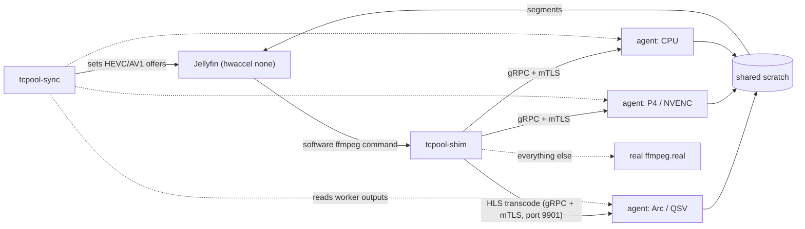

# Transcode pool

[](../.github/workflows/transcode.yml)
[](../.github/workflows/transcode-images.yml)

A shared pool of mixed GPUs that runs Jellyfin transcodes for several servers. A [shim](../docs/architecture.md#glossary) stands in for Jellyfin's ffmpeg, and one agent per GPU does the work.

The one part I'd call production is Dolby Vision 7 to 8.1: it's opt-in, and it's been running on my cluster since 2026-09-29. How far the rest of the pool gets rolled out is up to whoever deploys it.

## What it does

Jellyfin runs with hardware acceleration set to `none`, so it emits a portable software ffmpeg command line. The shim intercepts that command line and routes it to a worker. The agent validates it against an allowlist, rewrites it for its card, and runs ffmpeg into a shared scratch directory.

Basic transcode pooling needs no Jellyfin code change: the image swaps ffmpeg for the shim and Jellyfin uses `hwaccel none`. The Dolby Vision 7 to 8.1 and shared transcode directory features need the JellyMesh Jellyfin patches (bughunt patches 13, 17, 18, 19 for Dolby Vision; patch 16 for the shared directory). See [docs/dolby-vision.md](../docs/dolby-vision.md) and [docs/SHARED-TRANSCODE.md](docs/SHARED-TRANSCODE.md).

The manifests in [deploy/k8s/20-agents.yaml](deploy/k8s/20-agents.yaml) define three DaemonSets (qsv, nvenc, cpu), which target an Intel Arc A380 (QSV), an NVIDIA Tesla P4 (NVENC) and a CPU worker. Before the first segment, the shim re-runs a job on another worker. After the first segment, Jellyfin restarts the HLS job. [docs/RESULTS.md](../docs/RESULTS.md) holds lab drills for the shared transcode directory, calibration and startup latency. Freeze, partition and node-drain drills are still on the [roadmap](../docs/ROADMAP.md).

### Components

| Component | Path | What it is |
|---|---|---|
| `tcpool-shim` | [crates/shim](crates/shim) | Replaces Jellyfin's ffmpeg. HLS transcodes go to a worker; other invocations exec the real ffmpeg. |
| `tcpool-agent` | [crates/agent](crates/agent) | One per GPU. Validates, rewrites and runs the ffmpeg command, and refuses jobs when full. Hosts the Dolby Vision 7 to 8.1 conversion, the one piece running in production (opt-in). |
| `tcpool-sync` | [crates/sync](crates/sync) | Sets Jellyfin's HEVC/AV1 offers to what every worker can output. Serves `/metrics` and `/status` when `TC_METRICS_PORT` is set. |
| `tcpool-ir` | [crates/ir](crates/ir) | Shared translation and allowlist library. |
| `tcpool-proto` | [crates/proto](crates/proto) | gRPC definitions and mTLS helpers. |
| corpus | [corpus/](corpus/README.md) | Jellyfin 12 command lines with anonymized media paths, plus parity goldens. |
| fuzz | [fuzz/](fuzz) | cargo-fuzz targets `validate`, `render`, `filters`, `trickplay`. |
| calibration | [calibration/](calibration) | Lab measurements per card and settings, as CSV (`2026-09-26-p0.csv`, `2026-09-27-p5.csv`, `2026-09-28-pool-r1.csv`). Write-up: [transcode-calibration](../docs/engineering/transcode-calibration.md). |
| deploy | [deploy/](deploy) | Container files, entrypoint, alert rules, Kubernetes manifests, the Jellyfin integration contract. |
| spike | [spike/](spike) | Python prototype the Rust port is pinned to, and the protocol suite `proto_test.sh`. Reference only; nothing plays through it. |
| plugin | [plugin/](plugin) | "Transcode Pool" Jellyfin plugin: a read-only dashboard page backed by the sync `/status` JSON. Drain controls are planned ([docs/ROADMAP.md](../docs/ROADMAP.md), P10). |

### How it works



- The shim finds workers through a headless Service (`TC_WORKERS_DNS`, each A/AAAA record is one worker) plus an optional static list (`TC_WORKERS`).
- The agent turns jobs away when the card is full. Capacity is counted in weighted units (a 1440p or 4K job counts more than a 1080p job), set per card with `TC_CAPACITY`; see [docs/configuration.md](../docs/configuration.md).
- No AV1 is offered. The Tesla P4 can't encode it, so an AV1 session could never fail over. That call is from 2026-09-26, in [transcode-plan](../docs/engineering/transcode-plan.md).

Failover, from the code in `crates/shim/src/main.rs` and `crates/agent/src/config.rs` rather than from a drill:

| Event | Behavior |
|---|---|
| Worker dies before the first segment | The shim re-runs the job on another worker. |
| Worker dies after the first segment | The shim exits 255; Jellyfin's HLS restart resumes at the next missing segment on another worker. |
| Worker loses its shim | The agent fences its ffmpeg after 3 s (`TC_FENCE_AFTER` default), so two workers do not write the same output. |
| No frame from a worker | The shim treats the worker as lost after 6 s with no inbound frame (`DEAD_AFTER`). |

A direct-play stream is one long-lived HTTP connection and needs client Range retry after a hard kill; an HLS transcode failover just restarts ffmpeg. See [direct-play-failover](../docs/engineering/direct-play-failover.md). For the full design, see [docs/architecture.md](../docs/architecture.md).

### Dolby Vision 7 to 8.1

The agent converts Dolby Vision profile 7 dual-layer sources to profile 8.1 on the fly, in `crates/agent/src/dv81.rs`. It's opt-in (`JELLYMESH_DOVI_P7_TO_81=1` on Jellyfin) and off by default, and it's been running on my cluster since 2026-09-29. The EAC3 5.1 audio of a converting job passes through from my SHIELD to the AV receiver as Dolby Digital Plus; I checked that on 2026-09-30.

- Jellyfin marks a converting job with `-metadata:s:v:0 JELLYMESH_DOVI_P7_TO_81=1`; the pool also accepts `TC_DV81=1` as an alias.
- The agent converts only video-copy playback jobs with in-band RPU, `-copyts` and a single `-i`.
- The output is fMP4 HLS whose init segment carries a `dvvC` box.
- The enhancement layer is dropped, including on FEL sources.
- When conversion isn't possible, the fallback strips Dolby Vision and the client gets HDR10, not raw profile 7.
- Each signaled job increments one outcome of `tcpool_dv81_total{outcome}`.
- For the Android TV app, a converting job re-encodes TrueHD to EAC3 5.1 (patch 19).

How to enable, verify and roll back is in [docs/dolby-vision.md](../docs/dolby-vision.md), which also has the detail behind each bullet above.

## Requirements

Build:

- Rust 1.88 or newer (`rust-version` in `Cargo.toml`), with the `x86_64-unknown-linux-musl` target for static builds.
- A musl C compiler, because `ring` (the TLS crypto backend) compiles C: `musl-tools` on Debian/Ubuntu, `musl-gcc` on Fedora, or `CC_x86_64_unknown_linux_musl=gcc`.
- `podman` for local image builds ([deploy/build-images.sh](deploy/build-images.sh), and [deploy/build-musl.sh](deploy/build-musl.sh) in its default container mode).

Test:

- `ffmpeg` on the host for the protocol suite.

The agent image carries jellyfin-ffmpeg 8.1.2-Jellyfin, per the comment in [deploy/Containerfile.agent](deploy/Containerfile.agent).

## Build

Run these from `transcode/`. The first line is the check sequence CI runs (`.github/workflows/transcode.yml`).

```bash
cargo fmt --all --check && cargo clippy --all-targets -- -D warnings && cargo test
# static binaries
cargo build --release --target x86_64-unknown-linux-musl
```

Local images build in two steps. Both scripts are in `deploy/`.

```bash
deploy/build-musl.sh          # static binaries in a rust container, no host toolchain needed
deploy/build-images.sh [tag]  # builds both images with podman; nothing is pushed
```

| Variable | Script | Default | Effect |
|---|---|---|---|
| `TC_BUILD` | `deploy/build-musl.sh` | `container` | `TC_BUILD=host` uses the host's cargo and musl-gcc. |
| `TC_BUILDER_IMAGE` | `deploy/build-musl.sh` | `docker.io/library/rust:1-bookworm` | Builder container image. |
| `TC_REGISTRY` | `deploy/build-images.sh` | `ghcr.io/saabstory404` | Registry prefix in the image names. |

`build-images.sh` takes the tag as its first argument; the default is the short git SHA, else `dev`. It refuses binaries that are not statically linked.

| Image | Base | Contents |
|---|---|---|
| `tcpool-agent` | `ghcr.io/hotio/jellyfin:release-12.1`, pinned by digest | jellyfin-ffmpeg 8.1.2-Jellyfin, runs as uid 1000, entrypoint `tcpool-entry` (a shell PID 1 that relays SIGTERM so drain works). |
| `tcpool-shim` | `scratch` | Artifact only (`/tcpool-shim`, `/tcpool-sync`); not runnable. It is copied into the Jellyfin image. |

The two Containerfiles are [deploy/Containerfile.agent](deploy/Containerfile.agent) and [deploy/Containerfile.shim](deploy/Containerfile.shim).

## Configure

Environment variables, defaults and ports are in [docs/configuration.md](../docs/configuration.md). That page also covers capacity (`TC_CAPACITY`, `TC_MAX_JOBS`), the TLS variables, the sync variables and the orphan and detach settings. Deployment steps are in [docs/operations.md](../docs/operations.md), and the integration contract between the pool and the Jellyfin pod is [deploy/CONTRACT.md](deploy/CONTRACT.md).

## Run or use

Agents run as DaemonSets. The shim and sync binaries are installed in the Jellyfin image: [../image/Containerfile.jm5](../image/Containerfile.jm5) moves the real ffmpeg to `ffmpeg.real` (the shim's `TC_FFMPEG_REAL` default) and, per its comment, is a drop-in for pods that are not on the pool. I haven't checked the later image files here; see [docs/operations.md](../docs/operations.md) for the tag matrix.

Ports (`deploy/k8s/30-service.yaml`):

| Port | Use | Service |
|---|---|---|
| 9901 | gRPC over mTLS | `tcpool-agents` |
| 9902 | gRPC health | `tcpool-agents` |
| 9903 | Agent metrics | `tcpool-agents` |
| 9904 | Sync metrics | `tcpool-sync-metrics` |

Agent and sync metrics are off unless `TC_METRICS_PORT` is set; the manifests use 9903 for agents and expose 9904 for sync.

The manifests are in [deploy/k8s/](deploy/k8s), ordered by numeric prefix:

| File | Contents |
|---|---|
| `00-namespace.yaml` | Namespace. |
| `10-tls.yaml` | cert-manager pool CA and agent/client certificates. |
| `15-scratch.yaml` | Shared scratch volume (`transcode-scratch-media`, NFS, ReadWriteMany). |
| `20-agents.yaml` | Three DaemonSets: qsv, nvenc, cpu. |
| `30-service.yaml` | Headless Service `tcpool-agents` and Service `tcpool-sync-metrics`. |
| `40-pdb.yaml` | Three PodDisruptionBudgets. |
| `50-rbac.yaml` | Two ServiceAccounts. |
| `60-servicemonitor.yaml` | Optional: its header comment says it needs Prometheus-operator CRDs and fails without them. |

Alert rules are in [deploy/alerts.yaml](deploy/alerts.yaml). The `CONTRACT.md` note that the manifests aren't applied is from 2026-09-27; the Dolby Vision path has been running since 2026-09-29.

## Test

Unit, parity and property tests run with `cargo test`. The protocol suite exercises failover, fence, stall, pause, drain, allowlist and mTLS against the native binaries and needs ffmpeg:

```bash
B=target/x86_64-unknown-linux-musl/release
AGENT=$B/tcpool-agent SHIM=$B/tcpool-shim bash spike/proto_test.sh
```

The suite has 21 numbered cases, 1 to 21. Cases 17, 20, and 21 run in sub-steps (17a-17c; 20 plus 20a-20e; 21a-21h), so `spike/proto_test.sh` prints 35 `==` section headers. The workflow comment in `transcode.yml` lists an older subset of those labels; when they disagree, the assertions in `spike/proto_test.sh` and the workflow's `grep` checks are what counts.

| Workflow | Trigger | What it does |
|---|---|---|
| `transcode.yml`, job `tcpool` | push to main or PR touching `transcode/**`, manual dispatch | fmt, clippy `-D warnings`, `cargo test --locked`, musl build, protocol suite, uploads artifact `tcpool-musl` (agent, shim, sync). |
| `transcode.yml`, job `fuzz-smoke` | same | Nightly toolchain, cargo-fuzz 0.13.2, 60 s per target (`validate`, `render`, `filters`, `trickplay`) against the committed corpus, `-timeout=10`. |
| `transcode-images.yml` | push to main touching `transcode/**`, manual dispatch | Builds static binaries and pushes `ghcr.io/saabstory404/tcpool-agent:<sha>` and `tcpool-shim:<sha>`. Tags are commit SHAs, not `latest`. |

The Dolby Vision end-to-end test (`crates/agent/src/dv81_it.rs`) builds its own synthetic profile 7 fixture and skips when ffmpeg, ffprobe or libx265 is missing.

### Corpus

Every command line in `corpus/` must parse. The format is `<log kind>\t<full command line>`, one command per line, with media paths anonymized. The counts below are `wc -l` of each file as of 2026-09-30; the detail is in [corpus/README.md](corpus/README.md).

| File | Commands | Source |
|---|---|---|
| `prod-qsv.tsv` | 67 | Production Jellyfin with `hwaccel=qsv`; reference for the renderers. |
| `lab-sw.tsv` | 67 | Lab Jellyfin with `hwaccel=none`; what the shim receives. |
| `lab-trickplay.tsv` | 5 | Synthetic trickplay sprite extraction commands. |

Goldens (`corpus/goldens/`) are `spike-translate.json` and `render-calibrated.json`. Trickplay goes to the pool only when `TC_BATCH=1`.

## Limitations

| Limitation | Detail |
|---|---|
| CPU worker is slow | 0.18-0.59x realtime for x264/x265 `-preset slow` at 8 Mbps, one job, 8 threads, from the lab [calibration](../docs/engineering/transcode-calibration.md) — that preset is not what the pool worker runs by default. The [plan](../docs/engineering/transcode-plan.md) counts the CPU worker as last-resort spill capacity for overflow and failed-over sessions (section 7). |
| Arc tone mapping is a fixed curve | `tonemap_vaapi` ignores the Jellyfin UI algorithm, peak and desaturation settings. That's from the code. Honoring the setting is on the [roadmap](../docs/ROADMAP.md); see [troubleshooting](../docs/troubleshooting.md). |
| P4 bitrate overshoot | Up to +2.4% over the cap (h264 at 3M, calibrated settings) in [RESULTS](../docs/RESULTS.md). The [calibration write-up](../docs/engineering/transcode-calibration.md) reports P4 candidate VBR at 96-105% of the cap on different settings. Both are lab runs on the P4. |
| NFS mount options matter | With default options, new segments stayed invisible to other nodes for 12-23 s; the manifests set `actimeo=1` and `lookupcache=positive` ([deploy/k8s/15-scratch.yaml](deploy/k8s/15-scratch.yaml)). That came out of the lab; the observation is recorded in the manifest comment and the method never got written down. |
| `hvcE` sources not converted | Dolby Vision 7 files whose RPU sits in a Matroska Block Addition (`hvcE`) fall back to HDR10. When I counted my own library on 2026-09-27, 0 of 122 profile 7 files were `hvcE`-only. Tracked in [docs/ROADMAP.md](../docs/ROADMAP.md); see [dolby-vision](../docs/dolby-vision.md). |
| Two Jellyfins must not share one `TranscodingTempPath` root | Startup wipe; replicas need distinct `HOSTNAME`, or use shared mode. From the code, not from a drill. See [docs/SHARED-TRANSCODE.md](docs/SHARED-TRANSCODE.md). |
| ffmpeg major-version mismatch refusal | Not implemented; [deploy/CONTRACT.md](deploy/CONTRACT.md) says so. It's on the [roadmap](../docs/ROADMAP.md). |
| Other planned items | Online cost model, quality-aware placement, hedged start, probe cache, plugin drain controls; freeze, partition and node-drain drills. They live in the [transcode plan](../docs/engineering/transcode-plan.md) and the [roadmap](../docs/ROADMAP.md). |

## License

MIT for the Rust workspace (`Cargo.toml`; there is no MIT license file in `transcode/`). GPL-2.0 for the repository as a whole ([LICENSE](../LICENSE)).
